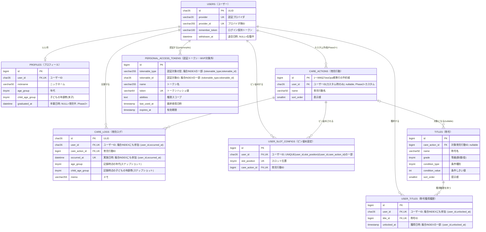

# TotoOps MVP データモデル（Step 2）

> 本ドキュメントは Laravel 実装前の **MVP データモデル詳細設計** です（DOA：データ先行）。
> 設計原則は [decisions.md](decisions.md) §1.3 に従う（主キー形式・ログ/マスタ分離・冪等性・個人情報最小限）。
> 確定したテーブルから順に記載します。**値の候補が未決の箇所は [decisions.md](decisions.md) の未決番号を明記**します。

## 共通方針

- **主キー**：**IDがURL・APIに露出するテーブルのみ ULID**（`CHAR(26)`。時系列ソート可、UUIDv7代替）、**それ以外は連番**（`BIGINT UNSIGNED`）。ULIDにするのは①`users`と④`care_logs`の2つだけで、②③⑤⑥⑦⑧は連番。判断基準は [decisions.md](decisions.md) §1.3「主キー形式の判断基準」を参照（ULIDが防ぐのはアクセスそのものではなく、ID値が漏らす副次情報。アクセス制御はPolicy／暗黙スコープで担保する）
- **ログ/マスタ分離**：高頻度で増える `care_logs` と、低頻度のマスタ（`users`・`profiles`・`titles` 等）を別テーブルに保つ
- **個人情報最小限**：認証テーブルにプロフィール情報を混ぜない。メール・パスワードは保持しない（SSO・Web Push前提）
- **最終ログイン日時は持たない**：活動判定は「育児ログ登録日（`care_logs.occurred_at`）」、トークン鮮度は `personal_access_tokens.last_used_at`（内部のみ）

## テーブル一覧（ドメイン7テーブル＋将来1）

TotoOps固有のドメインテーブルのみを挙げる。Laravel標準の`sessions`・`cache`・`cache_locks`・`jobs`・`job_batches`・`failed_jobs`は含まない。

**「設計」＝本ドキュメントでスキーマが確定しているか。「MVP実装」＝M0で実際にマイグレーションを作るか**（[implementation-plan.md](implementation-plan.md) M0）。⑧のみ両者が食い違うため、1列にまとめず分けている。

| # | テーブル | 分類 | 設計 | MVP実装 |
|---|---|---|---|---|
| 1 | `users` | マスタ（認証） | ✅ 確定 | ✅ 作る |
| 2 | `profiles` | マスタ | ✅ 確定 | ✅ 作る |
| 3 | `care_actions` | マスタ | ✅ 確定 | ✅ 作る |
| 4 | `care_logs` | **ログ** | ✅ 確定 | ✅ 作る |
| 5 | `user_slot_configs` | 設定 | ✅ 確定 | ✅ 作る |
| 6 | `titles` | マスタ | ✅ 確定 | ✅ 作る |
| 7 | `user_titles` | ログ寄り | ✅ 確定 | ✅ 作る |
| 8 | `personal_access_tokens` | システム | ✅ 確定 | ❌ 作らない（※） |

> ※ ⑧を追加するのは、**セッションCookieを保持できないクライアント（ブラウザ以外）にトークン認証を提供する段階**。現時点のロードマップで該当するのは将来案の NativePHP モバイル版のみで、MVP〜Phase 3 には該当する機能がない（Phase 3 の Web Push は VAPID 鍵ベースの認証で、購読情報も別テーブルになるため ⑧ とは無関係）。MVP は Inertia の同一オリジン構成＋セッション認証で完結するため Sanctum 自体が不要（[decisions.md](decisions.md) §1.5・§3.1、[implementation-plan.md](implementation-plan.md)「認証方式の整理／Sanctum 先送り」）。
>
> **作らないのに設計だけ先に固めてある理由**：`users.id` が ULID のため `tokenable_id` の型が Sanctum 標準と異なるという、**導入時に必ず引っかかる論点**を忘れないうちに記録しておくため（対処法は ⑧ の節を参照）。⑧ の節ごと削除しないこと。

---

## ER図（全体俯瞰）

凡例：`PK`=主キー／`FK`=外部キー／`UK`=ユニーク制約（単独 or 複合）に参加。Mermaidの`erDiagram`はキー種別として`PK`/`FK`/`UK`のみをサポートし独自の`IDX`表記はサポートしないため、非ユニークな複合インデックスへの参加はコメント（引用符内のテキスト）で表記している。複合キーの具体的な組み合わせは各テーブルの詳細節を参照。テーブル名は`物理名（論理名）`のエイリアス表記、カラム名の論理名はコメント欄の先頭に記載（`id`のみ論理名省略）。

補足：

- **`PERSONAL_ACCESS_TOKENS`（⑧）だけはMVPで作らない**（エイリアスに`MVP対象外`と付記しているのはこのため）。設計として確定しているので図には含めているが、M0のマイグレーション対象は残り7テーブルのみ。追加する条件は上記「テーブル一覧」の※を参照。
- `PERSONAL_ACCESS_TOKENS`と`USERS`の関係はSanctumのポリモーフィック関連（`tokenable_type`/`tokenable_id`）であり、DBレベルの実FK制約ではない。`tokenable_type`/`tokenable_id`はSanctum標準の複合インデックス対象（⑧参照）。
- `CARE_ACTIONS`と`TITLES`の関係は`care_action_id`がNULL許容（全体合計称号）のため、破線的な「0または1」の関係として描いている。
- `created_at`／`updated_at`は全テーブル共通のため、見やすさのためこの図では省略している（詳細は各テーブルの節を参照）。

---

## ① `users`（認証専用・マスタ）

Google SSO 専用。個人情報は持たず、認証の同定のみを担う。

| カラム | 型 | 制約 | 説明 |
|---|---|---|---|
| `id` | CHAR(26) | PK | 主キー（ULID） |
| `provider` | VARCHAR(20) | NOT NULL | 認証プロバイダ（例 `google`） |
| `provider_id` | VARCHAR(255) | NULL | プロバイダの安定ID（Google の `sub`）。**退会時に`NULL`を入れる**ため NULL 許容 |
| `remember_token` | VARCHAR(100) | NULL | Laravel 標準（ログイン保持） |
| `withdrawn_at` | DATETIME | NULL | 退会日時。`NULL`=在籍中。退会済み判定の正（[decisions.md](decisions.md) §1.1） |
| `created_at` | TIMESTAMP | NOT NULL | |
| `updated_at` | TIMESTAMP | NOT NULL | 行更新時刻。※**ログイン日時ではない** |

- **ユニーク制約**：`UNIQUE(provider, provider_id)`（同一アカウントの二重登録防止）。`provider_id`を NULL 許容にしても、MySQL は UNIQUE 内の NULL 同士を別物として扱うため、退会者が複数いても衝突しない
- **メール・パスワードは保持しない**（Web Pushのみ・個人情報最小限。未決#1 の有力案で確定）
- **ニックネーム／年代／子の年齢帯は持たない** → `profiles`（②）へ分離
- **最終ログイン日時カラムは持たない**（活動指標は育児ログ登録日）。`withdrawn_at`はこれとは別物で、活動指標ではなく状態遷移の記録であり、外部には公開しない
- **退会時は行を削除せず、値だけを書き換える**（in-place 匿名化。[decisions.md](decisions.md) §1.1「退会処理の方式」）：`provider = 'withdrawn'`／`provider_id = NULL`／`remember_token = NULL`／`withdrawn_at = now()`。`provider_id`が`NULL`になることで Google の`sub`と永久に一致せず、**ログイン不能がDBレベルで保証される**。行を残すのは④`care_logs`のFKの親として必要だからで、削除すると`ON DELETE CASCADE`で育児ログが道連れになり全体集計が過去に遡って変動してしまう
- **`deleted_at`／`SoftDeletes`は使わない**（③`care_actions`と同様、ただし理由は異なる）：論理削除は「データを保持したまま見えなくし、`restore()`で戻せる」ことが前提だが、退会は`provider_id`と`nickname`を破壊するため**復元不可能**であり、行自体は`care_logs`のFK親として**永久に生かし続ける**。`deleted_at`という名前は実態を偽る。加えて`SoftDeletes`トレイトのグローバルスコープは`User`の全クエリに`whereNull`を注入するため、`User::find()`が退会者を返さなくなり、`$careLog->user`が`null`になり、問い合わせ対応で退会者を探すのに毎回`withTrashed()`が必要になる。その見返りである「退会者を全クエリから隠す」効果は本アプリでは無価値（認証は`(provider, provider_id)`の一致で行い`provider_id = NULL`なら構造的に一致せず、集計は`care_logs`単独で`users`をJOINしない）。トレイトを付けずカラム名だけ`deleted_at`にするのはさらに危険で、Laravelの慣習上 SoftDeletes と誤読され、後から誰かがトレイトを足して上記の副作用を静かに埋め込む

---

## ② `profiles`（マスタ）

`users`（認証専用）とは分離し、プロフィール情報のみを持つ（[decisions.md](decisions.md) §1.3「ログ／マスタ分離」および個人情報最小限の方針）。

| カラム | 型 | 制約 | 説明 |
|---|---|---|---|
| `id` | BIGINT UNSIGNED | PK, AUTO_INCREMENT | 主キー（連番。IDが露出しないため） |
| `user_id` | CHAR(26) | NOT NULL, UNIQUE, FK→`users.id` ON DELETE CASCADE | 1ユーザー1プロフィール |
| `nickname` | VARCHAR(50) | NOT NULL | 表示名。文字数上限は暫定 |
| `age_group` | TINYINT UNSIGNED | NOT NULL | コード値。`App\Enums\AgeGroup`（int backed enum）に対応（[decisions.md](decisions.md) §1.1 で候補1採用を確定）。任意項目だが「未回答」を明示コード値（`Unanswered = 0`）として持つ |
| `child_age_group` | TINYINT UNSIGNED | NOT NULL | **いちばん下の子（末子）の年齢帯**。コード値で`App\Enums\ChildAgeGroup`（int backed enum）に対応。任意項目だが「未回答」を明示コード値（`Unanswered = 0`）として持つ（`age_group` と同じパターンで統一） |
| `graduated_at` | DATETIME | NULL | 卒業日時。`NULL`=育児中。復帰時は`NULL`に戻す（**Phase 2以降**の機能。[decisions.md](decisions.md) §1.1） |
| `created_at` | TIMESTAMP | NOT NULL | |
| `updated_at` | TIMESTAMP | NOT NULL | |

- `nickname` は必須（実際に文字列の入力が必要）。`age_group`・`child_age_group` は**いずれも任意**で統一する（[privacy.md](privacy.md) §2）。フォーム上どちらも未選択のまま送信可能で、未選択の場合はアプリ側が自動的に`Unanswered`を設定する。
- **DBにはコード値（int）のみを保存し、日本語ラベルは持たせない**（[decisions.md](decisions.md) §1.3「コード値とラベルの分離」）。日本語表記は PHP の backed enum の `label()` メソッド側にのみ持つ。
  - `App\Enums\AgeGroup: int` — `Unanswered = 0`（未回答） / `Twenties = 1`（20代） / `Thirties = 2`（30代） / `Forties = 3`（40代） / `FiftiesOrOver = 4`（50代以上）
  - `App\Enums\ChildAgeGroup: int` — `Unanswered = 0`（未回答） / `Zero = 1`（0歳） / `One = 2`（1歳） / `Two = 3`（2歳） / `Three = 4`（3歳） / `FourToSix = 5`（4〜6歳）
- `age_group`・`child_age_group` はいずれも `NOT NULL` とし、「未回答」を `Unanswered = 0` という明示コード値で統一的に表現する（`NULL` は使わない）。理由：(1) 集計（`GROUP BY`等）で `NULL` 専用の分岐が不要になる、(2) 両カラムとも「任意項目・未選択ならUnanswered」という同一パターンで扱え、`age_group`だけ特別扱いする必要がない。未選択時に`Unanswered`を設定する処理は、両カラムとも同じバリデーション層のロジックで担保する（DB制約上の必須・任意の違いは持たない）。
- **`child_age_group` は「いちばん下の子（末子）の年齢帯」で、子どもが複数いる世帯でも1値のみを保持する**（[decisions.md](decisions.md) §1.1 で確定）。複数の年齢帯を持つ中間テーブル（`profile_child_age_groups`）化や、`profiles` に子どもの人数・きょうだい有無を持たせる案は不採用：集計軸は1ユーザー1値のほうが母数＝ユーザー数と一致して解釈が単純であり、組み合わせを持たせると「粗い分類」という個人特定リスク低減の方針を無効化してしまうため。なお `care_logs`（④）は「どの子への行動か」を一切参照しないため子ども情報は本テーブルに閉じており、将来複数対応が必要になった場合も本テーブル側の変更だけで完結する（ログ側へ波及しない）。
- 都道府県・子どもの氏名／誕生日／月齢・顔写真・人数／きょうだい構成・本名は取得しない（[privacy.md](privacy.md) §5）。
- **`graduated_at` は卒業状態の唯一の表現**（**Phase 2以降**。[decisions.md](decisions.md) §1.1）。S7 設定画面の卒業ボタンで`now()`をセットし、「復帰／また育児する」ボタンで`NULL`に戻す。卒業してもデータは一切削除しない。`is_graduated` boolean や `status` enum は不採用（`*_at` の nullable timestamp はフラグと日時を二重管理にしないLaravel標準のイディオムで、`email_verified_at` と同型）。復帰時に`NULL`へ戻すため「いつ卒業したか」の履歴は残らない（既知のトレードオフ）。
- **退会時は行を削除せず、値だけを書き換える**（in-place 匿名化。[decisions.md](decisions.md) §1.1「退会処理の方式」）：`nickname`を固定値（`退会したユーザー`）に、`age_group`・`child_age_group`を`Unanswered`(0)に上書きする。④`care_logs`の`age_group`・`child_age_group`は記録時点のスナップショットなので、この上書きは過去の集計に影響しない。
- **表示言語（ロケール）は `profiles` に持たない**：日英切り替えは cookie 保持で実現し、DB スキーマは変更しない（MVP は多言語化の“構造”のみ組み込む軽量版。[decisions.md](decisions.md) §1.3、永続化の要否は未決 #19）。

---

## ③ `care_actions`（マスタ）

TotoOps定義の育児行動とユーザーカスタム育児行動を同一テーブルで管理する（[decisions.md](decisions.md) §1.3）。MVPでは`user_id IS NULL`の17行（[features.md](features.md)候補プール）のみが存在し、全て対等な候補として扱う（「常時表示用」「追加スロット用」という区別は持たない。詳細は[decisions.md](decisions.md) §1.3「育児行動UIアーキテクチャ」参照）。

| カラム | 型 | 制約 | 説明 |
|---|---|---|---|
| `id` | BIGINT UNSIGNED | PK, AUTO_INCREMENT | 主キー（連番）。`1`〜`999`はTotoOps標準行の予約域で、カスタム行は`1000`から採番される（下記「`id`の採番規則」参照） |
| `user_id` | CHAR(26) | NULL, FK→`users.id` ON DELETE CASCADE | `NULL`=TotoOps定義（Seeder固定）／値あり=ユーザーカスタム（**Phase 2以降**、MVPでは作成不可） |
| `name` | VARCHAR(50) | NOT NULL | 育児行動名（例：おむつ交換）。ユーザー自由入力のカスタムを含むため、`age_group`のような固定コード値ではなく素の文字列 |
| `sort_order` | SMALLINT UNSIGNED | NOT NULL DEFAULT 0 | 「その他」一覧・ピン留め設定画面での表示順（カテゴリ順に採番するため`id`の昇順とは一致しない。下記「`sort_order`の採番規則」参照） |
| `created_at` / `updated_at` | TIMESTAMP | NOT NULL | |

補足：

- `is_default`／`is_preset`のような列は持たない。「どの8個を常時表示するか」は本テーブルの属性ではなく、**ユーザーごとの選択**として⑤`user_slot_configs`側で管理する（[decisions.md](decisions.md) §1.3）。
- 登録時に自動セットする「共通のおすすめ初期8個」も、本テーブルの列としては持たない。**アプリ層の設定（config配列 or Seeder時の固定リスト）**として持ち、プロフィール登録完了時に⑤へ8行を作成する処理から参照する。具体的にどの8個にするかは未決（[decisions.md](decisions.md) 未決#11。実際の育児で使ってから確定する）。
- **`id`（標準17行）の採番規則**：TotoOps標準17行（`user_id IS NULL`）は、自動採番に任せず**Seederで`1`〜`17`を明示的に指定**する（[decisions.md](decisions.md) §1.3）。理由：Seeder実行前は自動採番のIDが存在せず、`config/totoops.php`（初期おすすめ8個）や⑥`titles`のSeederが標準の育児行動を名指しする手段が`name`（表示ラベル、変更されうる）の文字列一致しかなくなってしまう問題を避けるため。可読性のため、各IDは名前付きPHP定数（例：`App\Support\CareActionId::DIAPER_CHANGE`）として1箇所に定義し、`CareActionSeeder`・`TitleSeeder`・`config/totoops.php`から共通参照する。
- **標準行の予約域（`1`〜`999`）**：マイグレーションで`AUTO_INCREMENT`を`1000`（`App\Support\CareActionId::CUSTOM_ID_FLOOR`）に引き上げ、ユーザーカスタム行が必ず`1000`以降に採番されるようにする。目的は運用開始後の**標準行の追加余地の確保**で、予約しないとカスタム行が`18`以降を消費した時点で「18個目の標準の育児行動を追加したい」となった際に採番できなくなる。MySQLは明示IDで低い値をINSERTしてもカウンタを下げないため、Seederが`1`〜`17`を投入したあともこの床は保たれる。**この分離はDB側が保証するので、アプリ層のガードは不要**（Phase 2でカスタム作成を実装する際も、`CustomCareActionController@store`に特別な検査は入れない）。
  - **Seederは自動採番を明示的に無効化する**：`id`を`forceFill()`で指定しても、Eloquentは`incrementing = true`のままだとINSERT後に`LAST_INSERT_ID()`を読みに行く。MySQLはAUTO_INCREMENT値を生成しなかった場合に`0`を返すため、保存後のモデルの`id`が`0`に化ける（DBの行自体は正しい）。Seeder内では保存前に`$model->incrementing = false;`を立てる。
- **ユーザーカスタムの上限と削除方式**（[decisions.md](decisions.md) §1.3、**Phase 2以降の機能**）：MVPではカスタム作成自体を提供しない。Phase 2以降で対応する際は、生存数の上限を合計8個までとし、9個目作成時はユーザーが既存8個から1つを選んで**物理削除**する（選択UIの実装もPhase 2〜4のどこかで対応）。物理削除は紐づく`care_logs`（④）の履歴も`ON DELETE CASCADE`で道連れに削除するため、実行前にUIで「過去のログも削除されます」という警告を出し、ユーザーの同意を得てから実行する。ソフト削除・`SoftDeletes`（`deleted_at`）は使わない：本テーブルには「削除済みだが復元可能」という中間状態は存在せず（生存かカスケード物理削除かの2択）、ソフト削除のみだと削除・再作成を繰り返すたびに行数の上限を実効的に担保できないため。
- `name`の重複防止は、`user_id`にNULLが混在するとDBのUNIQUE制約だけでは素直に効かせにくい（MySQLはUNIQUE内のNULL同士を別物として扱う）ため、アプリ層（`user_id`スコープ内での重複チェック）で担保する。
- **`sort_order`の採番規則**：TotoOps定義17行はSeederで`1〜17`を明示的に採番する（ピン留めの有無で値が変わることはない）。**採番順は[features.md](features.md)のカテゴリ順**（日常ケア → 食事系 → 外出・移動 → 対応・耐久。日常ケア内は起床〜就寝の1日の流れ順）で、`id`の昇順とは一致しない（[decisions.md](decisions.md) §1.3）。並び替えたいときに変えるのは`sort_order`＝`CareActionSeeder`の配列の並びだけで、**永続化された主キーである`id`は変更しない**。カテゴリを表す列は持たない（分類軸としては不要で、表示順として`sort_order`に畳み込めば足りるため）。ユーザーカスタム行（Phase 2以降）は、そのユーザーの1個目が`18`、2個目が`19`…という形で採番する。この番号は**ユーザーごとに独立**しており、他ユーザーのカスタムと重複してよい（`sort_order`で並べ替えるクエリは常に「`user_id IS NULL`＋`user_id = 自分`」にスコープされるため、他ユーザーの値と比較される場面が無い）。カスタムを削除して9個目を作る場合も、空いた番号を詰め直す必要はなく、そのユーザーの既存カスタムの最大`sort_order` + 1を採番すればよい。

---

## ④ `care_logs`（ログ）

1回の育児行動＝1レコード（[decisions.md](decisions.md) §1.3）。父親が行った育児行動そのものを記録する、TotoOpsの中核テーブル。

| カラム | 型 | 制約 | 説明 |
|---|---|---|---|
| `id` | CHAR(26) | PK | ULID。`/care-logs/{care_log}`としてURLに露出するため（[decisions.md](decisions.md) §1.3） |
| `user_id` | CHAR(26) | NOT NULL, FK→`users.id` ON DELETE CASCADE | 記録した本人 |
| `care_action_id` | BIGINT UNSIGNED | NOT NULL, FK→`care_actions.id` ON DELETE CASCADE | 育児行動。カスタム育児行動の物理削除時は本テーブルの該当行も道連れ削除（③参照） |
| `occurred_at` | DATETIME | NOT NULL | 実施日時（秒精度。将来の時間帯別タイムラインチャート用。サブ秒は書き込み時に切り捨てる） |
| `age_group` | TINYINT UNSIGNED | NOT NULL | **記録時点**の投稿者の年代。`App\Enums\AgeGroup` のコード値（②`profiles.age_group` と同じ enum） |
| `child_age_group` | TINYINT UNSIGNED | NOT NULL | **記録時点**の末子の年齢帯。`App\Enums\ChildAgeGroup` のコード値（②`profiles.child_age_group` と同じ enum） |
| `memo` | VARCHAR(255) | NULL | 任意メモ |
| `created_at` / `updated_at` | TIMESTAMP | NOT NULL | |

インデックス：

- `INDEX (user_id, occurred_at)` — 日別タイムライン・今日／週／月集計用
- `UNIQUE (user_id, care_action_id, occurred_at)` — 二重送信防止（[decisions.md](decisions.md) §1.3）。専用の`idempotency_key`列は持たない。累計実績・育児行動別の集計（`user_id`＋`care_action_id`での絞り込み）もこのUNIQUEの**左端プレフィックス**で賄えるため、`INDEX (user_id, care_action_id)`は別途張らない（当初案では張る想定だったが、最も行数が増えるログテーブルでINSERTごとの不要なインデックス更新と容量が発生するだけなので撤回した）

補足：

- `count`・`duration_minutes`・`hp_delta`は持たない（[decisions.md](decisions.md) §1.3・§1.6）。1回の行動＝1行で記録し、回数は`COUNT(*)`で数える。`age_group`・`child_age_group`はこの原則の例外ではない：追加したのは**集計軸の凍結値**であって、複数回の行動を1行に畳み込むための集約値ではない。
- **`age_group`・`child_age_group`は記録時点のスナップショット**（[decisions.md](decisions.md) §1.3「集計軸に使う属性はログ側にスナップショットする」）。書き込み時に②`profiles`からコピーし、以後`profiles`が更新されても**過去ログの値は変えない**。これがないと、ユーザーが`child_age_group`を0歳→1歳に更新した瞬間に過去ログがすべて遡って「1歳のログ」に化け、Phase 2 の年代別・子ども年齢帯別集計が時間とともに書き換わってしまう。
  - **この2列にインデックスは張らない**。Phase 2 の全体傾向集計は`aggregate_*`経由になる想定で、MVPでこの2列を検索条件に使うクエリは存在しない。最も行数が増えるログテーブルでINSERTごとの不要なインデックス更新と容量を避ける（`INDEX (user_id, care_action_id)`を張らないのと同じ判断）。
  - プライバシー上の位置づけ：どちらも粗い区分（5区分／6区分）のコード値であり、単体では個人を識別しない（[privacy.md](privacy.md) §3・§4・§9）。
  - 退会時は②`profiles`側の年代を`Unanswered`に書き換えるが、**本テーブルのスナップショットは書き換えない**（[decisions.md](decisions.md) §1.1「退会処理の方式」）。これにより退会後も年代別集計が無傷で残る。
- 集計（累計実績・タイムライン・Phase 2の全体傾向）は`care_action_id`でグルーピングする。`care_actions.name`は表示専用で、集計ロジックには登場しない。
- 二重送信防止の`UNIQUE(user_id, care_action_id, occurred_at)`を機能させるため、**短タップ（即時記録）でもクライアントがタップ時点のタイムスタンプを`occurred_at`として必ず送信する**（サーバー採番の`now()`だとリクエストごとに値が変わり、同一操作のリトライ・二度発火を弾けない。`occurred_at`省略時の`now()`はフォールバックであり正規クライアントは使わない）。合わせてクライアント側は送信中の送信ボタンをdisableする。`occurred_at`は秒精度で保存しサブ秒は切り捨てるため、disableが間に合わなかった同一秒内の連打もこのUNIQUE制約で弾ける（[decisions.md](decisions.md) §1.3）。
- S10（実施日時指定画面）は分精度入力のため、既存記録と「育児行動×日時」が衝突した場合は「同じ日時に同じ記録があります」という分かりやすいバリデーションエラーを返す（同一分に同じ育児行動を2回記録したい場合は、1分ずらして登録する運用を許容する）。
- **`occurred_at`の上限バリデーション**：`occurred_at <= now() + 5分`をアプリ層（FormRequest）で検証する（DB制約ではない）。育児記録は過去の行動を記録するものであり未来日時は原則無意味だが、短タップ（即時記録）はクライアント端末のタイムスタンプをそのまま送信するため、端末クロックのわずかなズレ（自動時刻同期OFFの端末・安価な端末のドリフト等）で正当な「今記録した」操作が誤って弾かれないよう、5分の許容バッファを持たせる（[decisions.md](decisions.md) §1.3）。
- **`occurred_at`の下限バリデーション（遡り7日の締め）**：`occurred_at >= 7日前の00:00`（`config('totoops.care_log.backdate_days')`）をアプリ層で検証する（DB制約ではない）。上記の上限（`now() + 5分`）と合わせ、`occurred_at`の有効範囲は「**7日前の00:00 〜 現在＋5分**」となる。この制限は**作成・`occurred_at`の変更・削除の3操作すべて**に適用し、8日以上前の期間を不変にする（[decisions.md](decisions.md) §1.3「育児ログの遡り操作は直近7日に制限する」）。目的は、上記スナップショットと実際の年代のズレを上限で縛ることと、Phase 2 の`aggregate_*`を再計算不要にすること。締めを過ぎた記録の削除は問い合わせ窓口で個別に対応する（[privacy.md](privacy.md) §9）。
- **事後編集は`occurred_at`と`memo`のみ許可**。`care_action_id`の変更は不可とし、育児行動を変えたい場合はユーザーに削除→再作成（delete-insert）させる（[decisions.md](decisions.md) §1.3、[screens.md](screens.md) S11）。`occurred_at`の変更先が既存行と衝突する場合は`UNIQUE(user_id, care_action_id, occurred_at)`違反となるため、アプリ層で分かりやすいバリデーションエラーを返す。`memo`は称号判定にも集計にも関与しない表示専用の列のため、変更してもUNIQUE制約・称号・集計のいずれにも影響しない（自由入力欄に意図せず個人情報を書いた場合にユーザー自身が消せるようにするため編集を許す。[privacy.md](privacy.md) §9）。なお`age_group`・`child_age_group`は**編集対象に含めない**（記録時点の事実として凍結するため、ユーザーからも変更できない）。
- **`memo`の表示先はS13（記録履歴画面）**（[wireframes.md](wireframes.md) S13）。S12（集計）は件数の集計のみを扱うため`memo`を表示しない。

---

## ⑤ `user_slot_configs`（設定）

ユーザーが「常時表示8アイコン」にピン留めしている育児行動を管理する（[decisions.md](decisions.md) §1.3）。当初は「追加4スロットの管理」として構想していたが、8アイコン自体をユーザーが自由に選べる方式に変更したことに伴い、対象を「ピン留めされた最大8個」に広げた。**「どのスロット位置にどの育児行動を割り当てるか」という本テーブルの性質は設計変更の前後で変わっていないため、テーブル名はそのまま**（変更されたのはスロットの数と範囲だけで、名残の命名ではない）。

| カラム | 型 | 制約 | 説明 |
| --- | --- | --- | --- |
| `id` | BIGINT UNSIGNED | PK, AUTO_INCREMENT | 主キー（連番。IDが露出しないため） |
| `user_id` | CHAR(26) | NOT NULL, FK→`users.id` ON DELETE CASCADE | |
| `slot_position` | TINYINT UNSIGNED | NOT NULL | 1〜8（範囲はアプリ層バリデーションで担保）。画面上の並び順に対応。行数は**1ユーザーあたり最大8行**で、8行未満（空きスロットあり）も正常な状態として許容する（下記「行数の不変条件」参照） |
| `care_action_id` | BIGINT UNSIGNED | NOT NULL, FK→`care_actions.id` ON DELETE CASCADE | ピン留めされている育児行動。MVPでは③のTotoOps定義17個のいずれか。Phase 2以降は自分のカスタムも対象になり得る |
| `created_at` / `updated_at` | TIMESTAMP | NOT NULL | |

制約：

- `UNIQUE(user_id, slot_position)` — 1ユーザー・1スロット位置につき1行
- `UNIQUE(user_id, care_action_id)` — 同じ育児行動を複数スロットに重複ピン留めさせない

補足：

- プロフィール登録完了時に、アプリ層の「共通おすすめ初期8個」設定（③参照）を使って本テーブルに8行を自動作成する。
- 登録後はユーザーが設定画面から自由に入れ替え可能（本テーブルをupsertするだけ）。
- **「その他」ボタンの一覧** ＝ `care_actions`のTotoOps定義行（Phase 2以降は自分のカスタムも含む）のうち、本テーブルに`care_action_id`として存在しないもの（＝現在ピン留め中のものを除いた残り）。MVPでは17個からピン留め済みの8個を除いた9個が該当する（ピン留めが8個未満なら、その分だけ「その他」の件数が増える）。
- **行数の不変条件は「1ユーザーあたり最大8行」**（常に8行ではない）。プロフィール登録直後は必ず8行だが、Phase 2以降にユーザーカスタム育児行動を物理削除すると下記の`ON DELETE CASCADE`でピン留めも消え、**7行以下になりうる**。この状態を異常として扱わず、正常な状態として受け入れる（[decisions.md](decisions.md) §1.3）。
  - S3（記録画面）は4列×2段のグリッド枠を保ったまま、行が無い`slot_position`を**空きスロット**として描画する（タップするとS9へ誘導）。
  - S9（ピン留め設定画面）の保存バリデーションも「**8個以下**・重複なし・`slot_position` 1〜8」とし、8個未満のまま保存できる。
  - 未ピン留めの育児行動を自動で繰り上げ補充する方式は採らない：ユーザーが選んでいないアイコンが勝手にグリッドに現れるのは、「8アイコンの中身はユーザーが自由にピン留めできる」という本テーブルの前提（[decisions.md](decisions.md) §1.3）と矛盾するため。
- `care_action_id`の`ON DELETE CASCADE`は、Phase 2以降でユーザーカスタムを物理削除する際にピン留めも道連れで解除されるようにするためのもの（③参照）。TotoOps定義行はSeeder固定で削除されないため、MVP時点でこのカスケードが発生することはない（＝MVPの範囲では行数は常に8行になる）。
- `care_action_id`には「TotoOps定義（`user_id IS NULL`）、または自分自身のカスタム（`user_id`が自分）」以外を設定できないようにする必要がある。これはDBのFKだけでは表現できない条件（他ユーザーのカスタムIDを設定させない）なので、アプリ層のバリデーションで担保する（Phase 2以降、カスタム対応時に効いてくる）。
- **JSON配列案（不採用）**：`slot_position`／`care_action_id`の2カラムをやめ、1ユーザー1行で並び順を表す`care_action_id`のJSON配列（例：`[3,1,6,8,7,2,4,5]`）にまとめる案も検討したが、不採用とした。理由：(1) 本テーブルは「ログ」ではなく「設定」であり1ユーザー最大8行で頭打ちのため、行数削減のメリットがほぼ無い（「ログ/マスタ分離」の原則が懸念する高頻度増加はそもそも該当しない）、(2) JSON化すると配列内の個々の要素にはFK制約が効かず、カスタム育児行動削除時の自動整合性維持（`ON DELETE CASCADE`）や重複ピン留め防止（`UNIQUE(user_id, care_action_id)`）をアプリ層で肩代わりする必要が生じる、(3) `care_actions`とのJOINが`JSON_TABLE`やアプリ側デコード＋再ソートを要し、Eloquentの標準的な`hasMany`リレーションが使えなくなる（8行/ユーザー規模では速度自体は問題にならないが、実装の複雑さが増す）。

---

## ⑥ `titles`（マスタ）

育児ログに応じて父親が獲得する称号の定義。TotoOps側のSeeder固定マスタで、ユーザーカスタムはない。

| カラム | 型 | 制約 | 説明 |
| --- | --- | --- | --- |
| `id` | BIGINT UNSIGNED | PK, AUTO_INCREMENT | 主キー（連番。全ユーザー共通の公開マスタのため） |
| `care_action_id` | BIGINT UNSIGNED | NULL, FK→`care_actions.id` ON DELETE RESTRICT | 対象育児行動（例：おむつ交換）。`NULL`は特定の育児行動に紐づかない全体合計称号 |
| `name` | VARCHAR(50) | NOT NULL | 称号名（例：おむつ交換見習い）。**`Lv.1`のようなレベル表記は使わない**（段階は`grade`で表す。下記「`grade`の位置づけ」参照） |
| `grade` | TINYINT UNSIGNED | NOT NULL | コード値。`App\Enums\TitleGrade: int` — `Bronze = 0`（銅） / `Silver = 1`（銀） / `Gold = 2`（金）。獲得の重みを表す表示属性（下記「`grade`の位置づけ」参照） |
| `condition_type` | TINYINT UNSIGNED | NOT NULL | コード値。`App\Enums\TitleConditionType: int` — `Count = 0`（累計回数系） / `Streak = 1`（連続日数系） |
| `condition_value` | INT UNSIGNED | NOT NULL | しきい値（`Count`なら累計回数、`Streak`なら連続日数） |
| `sort_order` | SMALLINT UNSIGNED | NOT NULL DEFAULT 0 | **提示順**（TotoOpsが定める称号の並び順。下記「`sort_order`の位置づけ」参照） |
| `created_at` / `updated_at` | TIMESTAMP | NOT NULL | |

制約・インデックス：

- `UNIQUE (care_action_id, condition_type, condition_value)` — 同一系統（`care_action_id` × `condition_type`）内でのしきい値の重複を防ぐ。称号一覧（図鑑）は各系統につき**未獲得の最小しきい値1件**だけを見せる（[decisions.md](decisions.md) §1.3）ため、系統内でしきい値が重複すると表示対象が一意に定まらなくなる。
  - **全体合計称号（`care_action_id IS NULL`）はこの制約の対象外**：MySQLはUNIQUE内のNULL同士を別物として扱うため、`NULL`の行は何件でも通ってしまう（③`care_actions`の`name`と同じ制限）。`titles`はSeeder固定マスタでユーザー入力が入らないため、この穴はDB制約ではなくテスト（`TitleUniqueConstraintTest`）でSeeder投入値を検証する形で塞ぐ。
  - `grade`はこのキーに含めない。表示属性であって称号の同一性を持たず、将来の見直しで「1系統に銀を2つ」が必要になる余地を残すため（下記「`grade`の位置づけ」参照）。
  - `name`にはUNIQUEを張らない。下記「`id`の採番規則」が「`name`は非ユニークだからSeederの同一性キーに使えない」という前提で組み立てられており、そこと矛盾させないため。称号名の重複はSeederのレビューで防ぐ。

補足：

- 称号条件は複合化しない。「回数系（Count）」と「日数系（Streak・連続継続）」は**両方とも MVP から実装**し、別々の称号として扱う（[decisions.md](decisions.md) §1.3）。1つの`titles`行は必ずどちらか一方の`condition_type`のみを持つ。
- **`sort_order`の位置づけ**：「TotoOpsが定める称号の提示順」を表す唯一の並び順キー。用途は2つあり、いずれも**Seederが採番した値をそのまま`ORDER BY sort_order`で使う**（[decisions.md](decisions.md) §1.3「称号の提示順・等級・一覧表示」）。
  1. **S5（称号獲得モーダル）の複数同時獲得時の表示順（MVPで必要）**：1件の`care_logs`登録で複数の称号が同時に成立しうる（例：「おむつ交換100回」「全体合計500回」「7日連続」）。`POST /care-logs`のレスポンスに載せる獲得称号の配列をこの順に並べる。
  2. **Phase 2 の称号一覧（図鑑）画面の並び順**（[screens.md](screens.md)「称号一覧（図鑑）画面」）。
  - `grade`・`care_action_id`・`condition_value`を`ORDER BY`に並べる方式は採らない。`sort_order`1本にしておくことで、演出上の並べ替え（例：全体称号を先頭に出す）をSeederの値の差し替えだけで実現でき、クエリ側を変更せずに済むため。
- **`sort_order`の採番規則**：`TitleSeeder`の配列の並び順をそのまま`1`から採番する。ブロックはCount → 全体Streak → 育児行動別Streakの順で、**Count系・育児行動別Streak系はいずれも`care_actions.sort_order`（育児行動の表示順）に揃える**。**`id`とは一致しない**：`id`は永続化された主キーなので称号を後から追加すると末尾に採番するしかないが、`sort_order`は提示順を表す独立したキーなので、追加した称号も配列の正しい位置に差し込む（例：後から対象に加えた着替えのStreakは`id`が`85`〜`87`だが、提示順ではおむつ交換のStreakの直後に置く）。両者を混同すると、追加した育児行動の称号だけがS5の獲得モーダルで最後に出る。テスト`TitleSeedIntegrityTest`で検証する。
- **`grade`の位置づけ**：Pokémon LEGENDS Z-A の称号システム（金・銀・銅の3等級。金ほど取得条件が厳しい）を参考にした、**称号の段階を表す唯一の表現**。称号バッジの色・図鑑での重みの可視化に使う。**並び順キーではない**（並びは`sort_order`が単独で決める）。
  - **称号名に`Lv.1`／`Lv.5`のようなレベル表記は使わない**。段階の表現は`grade`に一本化し、称号名側は「**見習い → 職人 → 名人**」のように**名前そのもので成長を表す**。Count系の称号名はこの3つの接尾辞で統一し、接尾辞と`grade`を1対1に対応させる（称号名だけで等級が読み取れる状態を`TitleSeedIntegrityTest`で担保する）。理由（育児の有限性との整合）は [decisions.md](decisions.md) §1.3「称号の提示順・等級・一覧表示」を参照。
  - `condition_value`からの自動導出はしない。育児行動をまたぐと回数の意味が揃わないため（「おむつ交換50回」と「夜泣き対応50回」の重みは同じではない）、機械的に導出できず、称号ごとに明示的に指定する必要がある。
  - `condition_type`とは独立。Count・Streak のどちらにも銅／銀／金が存在しうる（例：`1週間連続育児ログ`＝銅、`1ヶ月連続おむつ交換`＝金）。
  - **カラム名を`rank`・`level`・`tier`にしない理由**：`rank`はMySQL 8.4の予約語（ウィンドウ関数`RANK()`）であり、かつ本プロジェクトの「人のランキングは作らない」という線引き（[concept.md](concept.md)）と語感が衝突する。`level`は上記のとおり称号名から廃したレベル表記を想起させる。`tier`は`App\Support\TitleId`の定数名`..._TIER1`（Seederの同一性キーとしての内部的な段階番号）と紛らわしい。`grade`（等級）はいずれとも衝突しない。
  - `TitleId`の定数名（`..._TIER1`など）は**コード内部の同一性キー**でユーザーには見えないため、上記の一本化の対象外。定数名を`..._GOLD`のように等級で構成すると等級を見直すたびに定数名まで書き換わり、`TitleId`が安定キーである意味が薄れる。
  - **全17育児行動に銅・銀・金の3段階を必ず揃える**（`TIER1`＝銅／`TIER2`＝銀／`TIER3`＝金）。「この育児行動には金が無い」という穴は作らない。等級としきい値の割り当ては [decisions.md](decisions.md) §1.3「称号名・等級・しきい値の確定内容」で確定済みで、一覧は [features.md](features.md)「称号一覧」にある。
- `Streak`は専用の集計テーブル・カラムを持たず、**都度動的に計算**する：判定対象範囲（`care_action_id`がNULLなら全育児行動、値ありならその育児行動のみ）で`care_logs.occurred_at`のDISTINCTな日付（JST暦日）を新しい順に取得し、直近保存した育児ログの日付を起点に連続日数を数える（[decisions.md](decisions.md) §1.3）。
- `condition_type`は`age_group`等と同じ「コード値とラベルの分離」方針に従う（[decisions.md](decisions.md) §1.3）。日本語ラベル（「累計回数」「連続日数」）はPHPの`label()`側にのみ持つ。
- `care_action_id`をNULL許容にしているのは、育児行動限定の称号（おむつ交換職人など）に加えて、将来「全育児行動の合計◯件達成」のような全体合計称号も作れるようにするため。
- `titles`はユーザー個別ではなく全ユーザー共通のマスタなので、`care_action_id`には**TotoOps定義（`user_id IS NULL`）の行のみ**を設定できるようにする（特定ユーザーのカスタム育児行動を指す称号は成立しないため）。DBのFKだけでは表現できないため、Seeder投入時・管理側での運用ルールとして担保する。`ON DELETE RESTRICT`にしているのも、称号が参照している育児行動の行を誤って削除できないようにするため（TotoOps定義行はSeeder固定で通常は削除されない）。
  - **ユーザーカスタム育児行動（Phase 2以降）の実績は、`care_action_id IS NULL`の全体合計称号でカバーする**。カスタム育児行動のログも`care_logs`に入るため、全体合計称号は追加設計なしでカウント対象に含む。カスタム育児行動そのものに専用の称号を作る方式は採らない：(1) `titles`に`user_id`を持たせるとマスタではなくなり、ログ／マスタ分離の原則（[decisions.md](decisions.md) §1.3）から外れる、(2) `ON DELETE RESTRICT`のため称号が紐づいたカスタム育児行動を物理削除できなくなり、「生存数8個の上限を超えたら1つ削除する」という運用（③参照）と噛み合わない、(3) TotoOps側が「おむつ交換職人」のような固有の称号名を用意できず、機械生成の汎用名になって称号の面白さが薄れる。
- 具体的なしきい値（`condition_value`の数値）は確定済み。Countは育児行動の**頻度帯**ごとの共通値（高頻度 50/200/500・中頻度 20/100/300・低頻度 10/30/100）、Streakは全体版 7/30/90日・育児行動別版 3/7/30日（[decisions.md](decisions.md) §1.3「称号名・等級・しきい値の確定内容」）。
- **`id`の採番規則**：③`care_actions`の標準17行と同じく、**Seederで固定のIDを明示的に指定**する（`1`から連番で、Count（`1`〜`51`）→ 全体Streak（`52`〜`54`）→ 育児行動別Streak（`55`〜`87`）の順。各IDは`App\Support\TitleId`に名前付き定数として定義する）。ユーザーが行を作らないテーブルなので、③と違い予約域の確保は不要（自動採番と衝突する行が生まれない）。`care_action_id * 10 + 段階`のような構造化採番は採らない：称号の絞り込み・並べ替えは`care_action_id`・`condition_type`・`sort_order`で足りるうえ、Countのしきい値が育児行動ごとに異なる以上ID側に規則を持たせても保守の手間が増えるだけだから（[decisions.md](decisions.md) §1.3）。理由：`name`（称号名）も`condition_value`（しきい値）も後から調整されうるため、Seederの同一性キーを`name`にすると称号名を修正した瞬間に既存行が更新されず**重複行が増える**（`titles.name`はUNIQUEではない）。⑦`user_titles.title_id`は`ON DELETE RESTRICT`かつ獲得済み行は永久保持のため、一度増えた重複行は削除もできない。定数名は変わりうる表示ラベルではなく「対象育児行動＋条件種別＋段階」（例：`TitleId::DIAPER_CHANGE_COUNT_TIER1`）で構成する。なお③と同じく、Seederは保存前に`$model->incrementing = false;`を立てる（③参照）。

---

## ⑦ `user_titles`（ログ寄り）

ユーザーがどの称号をいつ獲得したかを記録する。**行が作られるのは称号を獲得した瞬間のみ**で、未獲得ぶんの行はあらかじめ作らない（ユーザー登録時に`titles`の全行ぶんの`user_titles`を先行作成する方式は採らない）。

そのため、称号一覧（図鑑）画面で未獲得の称号を表示する場合も本テーブルの行数は増えない。`titles`（全ユーザー共通マスタ）を主テーブルにした`LEFT JOIN`で「未獲得＝`user_titles`側がNULL」として表現する（[screens.md](screens.md)「称号一覧（図鑑）画面」）。

| カラム | 型 | 制約 | 説明 |
| --- | --- | --- | --- |
| `id` | BIGINT UNSIGNED | PK, AUTO_INCREMENT | 主キー（連番。IDが露出しないため） |
| `user_id` | CHAR(26) | NOT NULL, FK→`users.id` ON DELETE CASCADE | |
| `title_id` | BIGINT UNSIGNED | NOT NULL, FK→`titles.id` ON DELETE RESTRICT | 獲得した称号 |
| `unlocked_at` | TIMESTAMP | NOT NULL | 獲得日時 |
| `created_at` / `updated_at` | TIMESTAMP | NOT NULL | |

制約・インデックス：

- `UNIQUE(user_id, title_id)` — 同じ称号を二重に獲得記録させない
- `INDEX (user_id, unlocked_at)` — 獲得履歴の時系列表示用

補足：

- `title_id`は`ON DELETE CASCADE`ではなく`RESTRICT`。`care_logs`と同様、`titles`側の都合（将来の称号廃止・改定など）でユーザーの獲得実績を巻き添えで消さないため。称号を廃止したい場合は物理削除ではなく`titles`側に非表示フラグを持たせる形を将来検討する（今回は追加しない）。
- 称号判定ロジック自体（`care_logs`を集計して`titles.condition_value`と比較し、条件を満たせば本テーブルに行を作るJob/Service）はデータモデルの範囲外。
- **一度作成された`user_titles`行は永久保持**。元になった`care_logs`が後から編集（`occurred_at`変更）・削除されても、再判定・取り消しは行わない（[decisions.md](decisions.md) §1.3）。

---

## ⑧ `personal_access_tokens`（システム・**MVPでは作らない**）

Laravel Sanctumが標準提供するテーブル。認証トークンを管理する。

**追加する条件**：セッションCookieを保持できないクライアント（ブラウザ以外）にトークン認証を提供する段階。現時点のロードマップで該当するのは将来案の NativePHP モバイル版のみ。MVP〜Phase 3 には該当機能がないため作らない（上記「テーブル一覧」の※、[implementation-plan.md](implementation-plan.md)「認証方式の整理／Sanctum 先送り」）。

本節を先に書いてあるのは、`users.id` が ULID であることに起因する `tokenable_id` の型の論点（下記補足）が導入時に必ず問題になるため。**実装しないからといって本節を削除しないこと。**

| カラム | 型 | 制約 | 説明 |
| --- | --- | --- | --- |
| `id` | BIGINT UNSIGNED | PK, AUTO_INCREMENT | Sanctum標準のまま（下記補足参照） |
| `tokenable_type` | VARCHAR(255) | NOT NULL | ポリモーフィック関連の型（常に`App\Models\User`） |
| `tokenable_id` | CHAR(26) | NOT NULL | `users.id`（ULID）。Sanctum標準の`UNSIGNED BIGINT`ではなく`CHAR(26)`になる（`Schema::morphUsingUlids()`により自動。マイグレーションの手書き換えは不要。下記補足参照） |
| `name` | VARCHAR(255) | NOT NULL | トークン名（例：`web-login`） |
| `token` | VARCHAR(64) | NOT NULL, UNIQUE | トークンのハッシュ値 |
| `abilities` | TEXT | NULL | 権限スコープ（JSON） |
| `last_used_at` | TIMESTAMP | NULL | サーバー内部のみで使用（[decisions.md](decisions.md) §1.3）。Prunable判定の入力 |
| `expires_at` | TIMESTAMP | NULL | Prunable判定の入力（しきい値Nは未決#15） |
| `created_at` / `updated_at` | TIMESTAMP | NOT NULL | |

補足：

- 主キー`id`はSanctum標準のauto-incrementのまま使う。共通方針（IDが露出しないテーブルは連番）とも一致しており、`id`はAPI/URLに露出せず認証はハッシュ化された`token`列で行うためULID化のメリットがない。パッケージ標準実装に沿う方が将来のアップデート時の互換性リスクも低い。
- `tokenable_id`はポリモーフィック関連の対象（`users.id`）の型に合わせる必要があるため、Sanctum標準の`UNSIGNED BIGINT`ではなく`CHAR(26)`になる。**ただしSanctumのマイグレーションを手で書き換える必要はない**：`AppServiceProvider::boot()`で`Schema::morphUsingUlids()`を1度呼んでおけば、Sanctum標準のマイグレーションが呼ぶ`$table->morphs('tokenable')`が自動的に`ulidMorphs()`（＝`CHAR(26)`）へ分岐する。`Illuminate\Database\Schema\Blueprint::morphs()`が`Builder::$defaultMorphKeyType`を見て`numericMorphs()`／`uuidMorphs()`／`ulidMorphs()`を切り替える実装で、**ULID主キーのためにフレームワークが用意した公式の切り替え**（Laravel 13の`vendor/laravel/framework`ソースで確認済み）。パッケージ標準実装から外れる対応ではないため、上記「主キー`id`はSanctum標準のまま使う」方針とも矛盾しない。
  - **設定漏れは静かには壊れない**：`morphUsingUlids()`を呼ばずに`vendor:publish`したマイグレーションをそのまま流すと`tokenable_id`が`BIGINT`のまま作られるが、MySQLのstrictモードで最初の`createToken()`時に型不一致で例外になるため、テストで確実に捕捉できる。誤った型のまま動き続けることはない。
  - **この対応が要るのはSanctumを実際に導入する段階**（将来のAPI／NativePHP版）。MVPはInertiaの同一オリジン構成＋セッション認証で完結するため**Sanctum自体が不要**（[decisions.md](decisions.md) §1.5・§3.1、[implementation-plan.md](implementation-plan.md)「認証方式の整理／Sanctum先送り」）。したがって「`users.id`をULIDにするとSanctumが使えなくなるのでは」という懸念は成立せず、ULID採用の是非を左右する材料にはならない（[decisions.md](decisions.md) §1.3「主キー形式の判断基準」の`users`の例外に関する補足を参照）。
- `Prunable`適用対象（[decisions.md](decisions.md) §1.3）：`expires_at`が期限切れ、または`expires_at`が`NULL`で`last_used_at`がN日以上前のトークンを削除する。Nの具体値は未決#15。
- `last_used_at`は集計・他ユーザーに公開しない（[privacy.md](privacy.md)「最終ログイン日時は公開しない」と整合）。
- `INDEX (tokenable_type, tokenable_id)` — Sanctum標準の複合インデックス（ポリモーフィック関連の検索用）。
