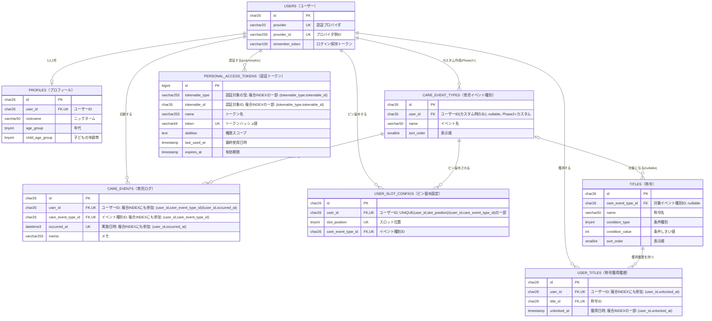

# TotoOps MVP データモデル（Step 2）

> 本ドキュメントは Laravel 実装前の **MVP データモデル詳細設計** です（DOA：データ先行）。
> 設計原則は [decisions.md](decisions.md) §1.3 に従う（UUID/ULID・ログ/マスタ分離・冪等性・個人情報最小限）。
> 確定したテーブルから順に記載します。**値の候補が未決の箇所は [decisions.md](decisions.md) の未決番号を明記**します。

## 共通方針

- **主キー**：連番ではなく **ULID**（`CHAR(26)`。時系列ソート可、UUIDv7代替。B-tree断片化を避ける）。例外：⑧`personal_access_tokens`はSanctum標準のauto-incrementのまま（理由は⑧参照）
- **ログ/マスタ分離**：高頻度で増える `care_events` と、低頻度のマスタ（`users`・`profiles`・`titles` 等）を別テーブルに保つ
- **個人情報最小限**：認証テーブルにプロフィール情報を混ぜない。メール・パスワードは保持しない（SSO・Web Push前提）
- **最終ログイン日時は持たない**：活動判定は「育児イベント登録日（`care_events.occurred_at`）」、トークン鮮度は `personal_access_tokens.last_used_at`（内部のみ）

## テーブル一覧（MVP・8テーブル）

| # | テーブル | 分類 | 状態 |
|---|---|---|---|
| 1 | `users` | マスタ（認証） | ✅ 確定 |
| 2 | `profiles` | マスタ | ✅ 確定 |
| 3 | `care_event_types` | マスタ | ✅ 確定 |
| 4 | `care_events` | **ログ** | ✅ 確定 |
| 5 | `user_slot_configs` | 設定 | ✅ 確定 |
| 6 | `titles` | マスタ | ✅ 確定 |
| 7 | `user_titles` | ログ寄り | ✅ 確定 |
| 8 | `personal_access_tokens` | システム | ✅ 確定 |

---

## ER図（全体俯瞰）

凡例：`PK`=主キー／`FK`=外部キー／`UK`=ユニーク制約（単独 or 複合）に参加。Mermaidの`erDiagram`はキー種別として`PK`/`FK`/`UK`のみをサポートし独自の`IDX`表記はサポートしないため、非ユニークな複合インデックスへの参加はコメント（引用符内のテキスト）で表記している。複合キーの具体的な組み合わせは各テーブルの詳細節を参照。テーブル名は`物理名（論理名）`のエイリアス表記、カラム名の論理名はコメント欄の先頭に記載（`id`のみ論理名省略）。

補足：

- `PERSONAL_ACCESS_TOKENS`と`USERS`の関係はSanctumのポリモーフィック関連（`tokenable_type`/`tokenable_id`）であり、DBレベルの実FK制約ではない。`tokenable_type`/`tokenable_id`はSanctum標準の複合インデックス対象（⑧参照）。
- `CARE_EVENT_TYPES`と`TITLES`の関係は`care_event_type_id`がNULL許容（全体合計称号）のため、破線的な「0または1」の関係として描いている。
- `created_at`／`updated_at`は全テーブル共通のため、見やすさのためこの図では省略している（詳細は各テーブルの節を参照）。

---

## ① `users`（認証専用・マスタ）

Google SSO 専用。個人情報は持たず、認証の同定のみを担う。

| カラム | 型 | 制約 | 説明 |
|---|---|---|---|
| `id` | CHAR(26) | PK | 主キー（ULID） |
| `provider` | VARCHAR(20) | NOT NULL | 認証プロバイダ（例 `google`） |
| `provider_id` | VARCHAR(255) | NOT NULL | プロバイダの安定ID（Google の `sub`） |
| `remember_token` | VARCHAR(100) | NULL | Laravel 標準（ログイン保持） |
| `created_at` | TIMESTAMP | NOT NULL | |
| `updated_at` | TIMESTAMP | NOT NULL | 行更新時刻。※**ログイン日時ではない** |

- **ユニーク制約**：`UNIQUE(provider, provider_id)`（同一アカウントの二重登録防止）
- **メール・パスワードは保持しない**（Web Pushのみ・個人情報最小限。未決#1 の有力案で確定）
- **ニックネーム／年代／子の年齢帯は持たない** → `profiles`（②）へ分離
- **最終ログイン日時カラムは持たない**（活動指標は育児イベント登録日）

---

## ② `profiles`（マスタ）

`users`（認証専用）とは分離し、プロフィール情報のみを持つ（[decisions.md](decisions.md) §1.3「ログ／マスタ分離」および個人情報最小限の方針）。

| カラム | 型 | 制約 | 説明 |
|---|---|---|---|
| `id` | CHAR(26) | PK | 主キー（ULID） |
| `user_id` | CHAR(26) | NOT NULL, UNIQUE, FK→`users.id` ON DELETE CASCADE | 1ユーザー1プロフィール |
| `nickname` | VARCHAR(50) | NOT NULL | 表示名。文字数上限は暫定 |
| `age_group` | TINYINT UNSIGNED | NOT NULL | コード値。`App\Enums\AgeGroup`（int backed enum）に対応（[decisions.md](decisions.md) §1.1 で候補1採用を確定）。任意項目だが「未回答」を明示コード値（`Unanswered = 0`）として持つ |
| `child_age_group` | TINYINT UNSIGNED | NOT NULL | コード値。`App\Enums\ChildAgeGroup`（int backed enum）に対応。任意項目だが「未回答」を明示コード値（`Unanswered = 0`）として持つ（`age_group` と同じパターンで統一） |
| `created_at` | TIMESTAMP | NOT NULL | |
| `updated_at` | TIMESTAMP | NOT NULL | |

- `nickname` は必須（実際に文字列の入力が必要）。`age_group`・`child_age_group` は**いずれも任意**で統一する（[privacy.md](privacy.md) §2）。フォーム上どちらも未選択のまま送信可能で、未選択の場合はアプリ側が自動的に`Unanswered`を設定する。
- **DBにはコード値（int）のみを保存し、日本語ラベルは持たせない**（[decisions.md](decisions.md) §1.3「コード値とラベルの分離」）。日本語表記は PHP の backed enum の `label()` メソッド側にのみ持つ。
  - `App\Enums\AgeGroup: int` — `Unanswered = 0`（未回答） / `Twenties = 1`（20代） / `Thirties = 2`（30代） / `Forties = 3`（40代） / `FiftiesOrOver = 4`（50代以上）
  - `App\Enums\ChildAgeGroup: int` — `Unanswered = 0`（未回答） / `Zero = 1`（0歳） / `One = 2`（1歳） / `Two = 3`（2歳） / `Three = 4`（3歳） / `FourToSix = 5`（4〜6歳）
- `age_group`・`child_age_group` はいずれも `NOT NULL` とし、「未回答」を `Unanswered = 0` という明示コード値で統一的に表現する（`NULL` は使わない）。理由：(1) 集計（`GROUP BY`等）で `NULL` 専用の分岐が不要になる、(2) 両カラムとも「任意項目・未選択ならUnanswered」という同一パターンで扱え、`age_group`だけ特別扱いする必要がない。未選択時に`Unanswered`を設定する処理は、両カラムとも同じバリデーション層のロジックで担保する（DB制約上の必須・任意の違いは持たない）。
- 都道府県・子どもの氏名／誕生日／月齢・顔写真・本名は取得しない（[privacy.md](privacy.md) §5）。

---

## ③ `care_event_types`（マスタ）

TotoOps定義のイベント種別とユーザーカスタムイベントを同一テーブルで管理する（[decisions.md](decisions.md) §1.3）。MVPでは`user_id IS NULL`の17行（[features.md](features.md)候補プール）のみが存在し、全て対等な候補として扱う（「常時表示用」「追加スロット用」という区別は持たない。詳細は[decisions.md](decisions.md) §1.3「育児イベントUIアーキテクチャ」参照）。

| カラム | 型 | 制約 | 説明 |
|---|---|---|---|
| `id` | CHAR(26) | PK | 主キー（ULID） |
| `user_id` | CHAR(26) | NULL, FK→`users.id` ON DELETE CASCADE | `NULL`=TotoOps定義（Seeder固定）／値あり=ユーザーカスタム（**Phase 2以降**、MVPでは作成不可） |
| `name` | VARCHAR(50) | NOT NULL | イベント名（例：おむつ交換）。ユーザー自由入力のカスタムを含むため、`age_group`のような固定コード値ではなく素の文字列 |
| `sort_order` | SMALLINT UNSIGNED | NOT NULL DEFAULT 0 | 「その他」一覧・ピン留め設定画面での表示順 |
| `created_at` / `updated_at` | TIMESTAMP | NOT NULL | |

補足：

- `is_default`／`is_preset`のような列は持たない。「どの8個を常時表示するか」は本テーブルの属性ではなく、**ユーザーごとの選択**として⑤`user_slot_configs`側で管理する（[decisions.md](decisions.md) §1.3）。
- 登録時に自動セットする「共通のおすすめ初期8個」も、本テーブルの列としては持たない。**アプリ層の設定（config配列 or Seeder時の固定リスト）**として持ち、プロフィール登録完了時に⑤へ8行を作成する処理から参照する。具体的にどの8個にするかは未決（[decisions.md](decisions.md) 未決#11。実際の育児で使ってから確定する）。
- **ユーザーカスタムの上限と削除方式**（[decisions.md](decisions.md) §1.3、**Phase 2以降の機能**）：MVPではカスタム作成自体を提供しない。Phase 2以降で対応する際は、生存数の上限を合計8個までとし、9個目作成時はユーザーが既存8個から1つを選んで**物理削除**する（選択UIの実装もPhase 2〜4のどこかで対応）。物理削除は紐づく`care_events`（④）の履歴も`ON DELETE CASCADE`で道連れに削除するため、実行前にUIで「過去のログも削除されます」という警告を出し、ユーザーの同意を得てから実行する。ソフト削除・`SoftDeletes`（`deleted_at`）は使わない：本テーブルには「削除済みだが復元可能」という中間状態は存在せず（生存かカスケード物理削除かの2択）、ソフト削除のみだと削除・再作成を繰り返すたびに行数の上限を実効的に担保できないため。
- `name`の重複防止は、`user_id`にNULLが混在するとDBのUNIQUE制約だけでは素直に効かせにくい（MySQLはUNIQUE内のNULL同士を別物として扱う）ため、アプリ層（`user_id`スコープ内での重複チェック）で担保する。
- **`sort_order`の採番規則**：TotoOps定義17行はSeederで`1〜17`を明示的に採番する（ピン留めの有無で値が変わることはない）。ユーザーカスタム行（Phase 2以降）は、そのユーザーの1個目が`18`、2個目が`19`…という形で採番する。この番号は**ユーザーごとに独立**しており、他ユーザーのカスタムと重複してよい（`sort_order`で並べ替えるクエリは常に「`user_id IS NULL`＋`user_id = 自分`」にスコープされるため、他ユーザーの値と比較される場面が無い）。カスタムを削除して9個目を作る場合も、空いた番号を詰め直す必要はなく、そのユーザーの既存カスタムの最大`sort_order` + 1を採番すればよい。

---

## ④ `care_events`（ログ）

1イベント＝1レコード（[decisions.md](decisions.md) §1.3）。父親が行った育児行動そのものを記録する、TotoOpsの中核テーブル。

| カラム | 型 | 制約 | 説明 |
|---|---|---|---|
| `id` | CHAR(26) | PK | ULID |
| `user_id` | CHAR(26) | NOT NULL, FK→`users.id` ON DELETE CASCADE | 記録した本人 |
| `care_event_type_id` | CHAR(26) | NOT NULL, FK→`care_event_types.id` ON DELETE CASCADE | イベント種別。カスタム種別の物理削除時は本テーブルの該当行も道連れ削除（③参照） |
| `occurred_at` | DATETIME(3) | NOT NULL | 実施日時（ミリ秒まで記録。将来の時間帯別タイムラインチャート用） |
| `memo` | VARCHAR(255) | NULL | 任意メモ |
| `created_at` / `updated_at` | TIMESTAMP | NOT NULL | |

インデックス：

- `INDEX (user_id, care_event_type_id)` — 累計実績・種別別集計用
- `INDEX (user_id, occurred_at)` — 日別タイムライン・今日／週／月集計用
- `UNIQUE (user_id, care_event_type_id, occurred_at)` — 二重送信防止（[decisions.md](decisions.md) §1.3）。専用の`idempotency_key`列は持たない

補足：

- `count`・`duration_minutes`・`hp_delta`は持たない（[decisions.md](decisions.md) §1.3・§1.6）。1回の行動＝1行で記録し、回数は`COUNT(*)`で数える。
- 集計（累計実績・タイムライン・Phase 2の全体傾向）は`care_event_type_id`でグルーピングする。`care_event_types.name`は表示専用で、集計ロジックには登場しない。
- 二重送信防止の`UNIQUE(user_id, care_event_type_id, occurred_at)`と合わせて、クライアント側は送信中の送信ボタンをdisableする（[decisions.md](decisions.md) §1.3）。
- **事後編集は`occurred_at`のみ許可**。`care_event_type_id`の変更は不可とし、種別を変えたい場合はユーザーに削除→再作成（delete-insert）させる（[decisions.md](decisions.md) §1.3、[screens.md](screens.md) S11）。`occurred_at`の変更先が既存行と衝突する場合は`UNIQUE(user_id, care_event_type_id, occurred_at)`違反となるため、アプリ層で分かりやすいバリデーションエラーを返す。

---

## ⑤ `user_slot_configs`（設定）

ユーザーが「常時表示8アイコン」にピン留めしている育児イベント種別を管理する（[decisions.md](decisions.md) §1.3）。当初は「追加4スロットの管理」として構想していたが、8アイコン自体をユーザーが自由に選べる方式に変更したことに伴い、役割を「ピン留めされた最大8個の管理」に変更した（テーブル名は流用）。

| カラム | 型 | 制約 | 説明 |
| --- | --- | --- | --- |
| `id` | CHAR(26) | PK | ULID |
| `user_id` | CHAR(26) | NOT NULL, FK→`users.id` ON DELETE CASCADE | |
| `slot_position` | TINYINT UNSIGNED | NOT NULL | 1〜8（範囲はアプリ層バリデーションで担保）。画面上の並び順に対応 |
| `care_event_type_id` | CHAR(26) | NOT NULL, FK→`care_event_types.id` ON DELETE CASCADE | ピン留めされている種別。MVPでは③のTotoOps定義17個のいずれか。Phase 2以降は自分のカスタムも対象になり得る |
| `created_at` / `updated_at` | TIMESTAMP | NOT NULL | |

制約：

- `UNIQUE(user_id, slot_position)` — 1ユーザー・1スロット位置につき1行
- `UNIQUE(user_id, care_event_type_id)` — 同じ種別を複数スロットに重複ピン留めさせない

補足：

- プロフィール登録完了時に、アプリ層の「共通おすすめ初期8個」設定（③参照）を使って本テーブルに8行を自動作成する。
- 登録後はユーザーが設定画面から自由に入れ替え可能（本テーブルをupsertするだけ）。
- **「その他」ボタンの一覧** ＝ `care_event_types`のTotoOps定義行（Phase 2以降は自分のカスタムも含む）のうち、本テーブルに`care_event_type_id`として存在しないもの（＝現在ピン留め中の8個を除いた残り）。MVPでは17個中8個を除いた9個が該当する。
- `care_event_type_id`の`ON DELETE CASCADE`は、Phase 2以降でユーザーカスタムを物理削除する際にピン留めも道連れで解除されるようにするためのもの（③参照）。TotoOps定義行はSeeder固定で削除されないため、MVP時点でこのカスケードが発生することはない。
- `care_event_type_id`には「TotoOps定義（`user_id IS NULL`）、または自分自身のカスタム（`user_id`が自分）」以外を設定できないようにする必要がある。これはDBのFKだけでは表現できない条件（他ユーザーのカスタムIDを設定させない）なので、アプリ層のバリデーションで担保する（Phase 2以降、カスタム対応時に効いてくる）。
- **JSON配列案（不採用）**：`slot_position`／`care_event_type_id`の2カラムをやめ、1ユーザー1行で並び順を表す`care_event_type_id`のJSON配列（例：`[3,1,6,8,7,2,4,5]`）にまとめる案も検討したが、不採用とした。理由：(1) 本テーブルは「ログ」ではなく「設定」であり1ユーザー最大8行で頭打ちのため、行数削減のメリットがほぼ無い（「ログ/マスタ分離」の原則が懸念する高頻度増加はそもそも該当しない）、(2) JSON化すると配列内の個々の要素にはFK制約が効かず、カスタム種別削除時の自動整合性維持（`ON DELETE CASCADE`）や重複ピン留め防止（`UNIQUE(user_id, care_event_type_id)`）をアプリ層で肩代わりする必要が生じる、(3) `care_event_types`とのJOINが`JSON_TABLE`やアプリ側デコード＋再ソートを要し、Eloquentの標準的な`hasMany`リレーションが使えなくなる（8行/ユーザー規模では速度自体は問題にならないが、実装の複雑さが増す）。

---

## ⑥ `titles`（マスタ）

育児ログに応じて父親が獲得する称号の定義。TotoOps側のSeeder固定マスタで、ユーザーカスタムはない。

| カラム | 型 | 制約 | 説明 |
| --- | --- | --- | --- |
| `id` | CHAR(26) | PK | ULID |
| `care_event_type_id` | CHAR(26) | NULL, FK→`care_event_types.id` ON DELETE RESTRICT | 対象イベント種別（例：おむつ交換）。`NULL`は特定種別に紐づかない全体合計称号 |
| `name` | VARCHAR(50) | NOT NULL | 称号名（例：おむつ交換士 Lv.1） |
| `condition_type` | TINYINT UNSIGNED | NOT NULL | コード値。`App\Enums\TitleConditionType: int` — `Count = 0`（累計回数系） / `Streak = 1`（連続日数系） |
| `condition_value` | INT UNSIGNED | NOT NULL | しきい値（`Count`なら累計回数、`Streak`なら連続日数） |
| `sort_order` | SMALLINT UNSIGNED | NOT NULL DEFAULT 0 | 表示順 |
| `created_at` / `updated_at` | TIMESTAMP | NOT NULL | |

補足：

- 称号条件は複合化しない。「回数系」と「日数系（連続継続）」は別々の称号として実装する（[decisions.md](decisions.md) §1.3）。1つの`titles`行は必ずどちらか一方の`condition_type`のみを持つ。
- `condition_type`は`age_group`等と同じ「コード値とラベルの分離」方針に従う（[decisions.md](decisions.md) §1.3）。日本語ラベル（「累計回数」「連続日数」）はPHPの`label()`側にのみ持つ。
- `care_event_type_id`をNULL許容にしているのは、種別限定称号（おむつ交換士など）に加えて、将来「全種別合計◯件達成」のような全体合計称号も作れるようにするため。
- `titles`はユーザー個別ではなく全ユーザー共通のマスタなので、`care_event_type_id`には**TotoOps定義（`user_id IS NULL`）の行のみ**を設定できるようにする（特定ユーザーのカスタム種別を指す称号は成立しないため）。DBのFKだけでは表現できないため、Seeder投入時・管理側での運用ルールとして担保する。`ON DELETE RESTRICT`にしているのも、称号が参照している種別行を誤って削除できないようにするため（TotoOps定義行はSeeder固定で通常は削除されない）。
- 具体的なしきい値（`condition_value`の数値）は未決（[decisions.md](decisions.md) 未決#4）。

---

## ⑦ `user_titles`（ログ寄り）

ユーザーがどの称号をいつ獲得したかを記録する。

| カラム | 型 | 制約 | 説明 |
| --- | --- | --- | --- |
| `id` | CHAR(26) | PK | ULID |
| `user_id` | CHAR(26) | NOT NULL, FK→`users.id` ON DELETE CASCADE | |
| `title_id` | CHAR(26) | NOT NULL, FK→`titles.id` ON DELETE RESTRICT | 獲得した称号 |
| `unlocked_at` | TIMESTAMP | NOT NULL | 獲得日時 |
| `created_at` / `updated_at` | TIMESTAMP | NOT NULL | |

制約・インデックス：

- `UNIQUE(user_id, title_id)` — 同じ称号を二重に獲得記録させない
- `INDEX (user_id, unlocked_at)` — 獲得履歴の時系列表示用

補足：

- `title_id`は`ON DELETE CASCADE`ではなく`RESTRICT`。`care_events`と同様、`titles`側の都合（将来の称号廃止・改定など）でユーザーの獲得実績を巻き添えで消さないため。称号を廃止したい場合は物理削除ではなく`titles`側に非表示フラグを持たせる形を将来検討する（今回は追加しない）。
- 称号判定ロジック自体（`care_events`を集計して`titles.condition_value`と比較し、条件を満たせば本テーブルに行を作るJob/Service）はデータモデルの範囲外。
- **一度作成された`user_titles`行は永久保持**。元になった`care_events`が後から編集（`occurred_at`変更）・削除されても、再判定・取り消しは行わない（[decisions.md](decisions.md) §1.3）。

---

## ⑧ `personal_access_tokens`（システム）

Laravel Sanctumが標準提供するテーブル。認証トークンを管理する。

| カラム | 型 | 制約 | 説明 |
| --- | --- | --- | --- |
| `id` | BIGINT UNSIGNED | PK, AUTO_INCREMENT | Sanctum標準のまま（他テーブルのULID方針は適用しない。下記補足参照） |
| `tokenable_type` | VARCHAR(255) | NOT NULL | ポリモーフィック関連の型（常に`App\Models\User`） |
| `tokenable_id` | CHAR(26) | NOT NULL | `users.id`（ULID）。Sanctum標準は`UNSIGNED BIGINT`だが、`users.id`がULIDのため型変更が必須 |
| `name` | VARCHAR(255) | NOT NULL | トークン名（例：`web-login`） |
| `token` | VARCHAR(64) | NOT NULL, UNIQUE | トークンのハッシュ値 |
| `abilities` | TEXT | NULL | 権限スコープ（JSON） |
| `last_used_at` | TIMESTAMP | NULL | サーバー内部のみで使用（[decisions.md](decisions.md) §1.3）。Prunable判定の入力 |
| `expires_at` | TIMESTAMP | NULL | Prunable判定の入力（しきい値Nは未決#15） |
| `created_at` / `updated_at` | TIMESTAMP | NOT NULL | |

補足：

- 主キー`id`はプロジェクト全体のULID方針の例外として、Sanctum標準のauto-incrementのまま使う。理由：`id`はAPI/URLに露出せず、認証はハッシュ化された`token`列で行うためULID化のセキュリティ上のメリットがほぼ無く、パッケージ標準実装に沿う方が将来のアップデート時の互換性リスクが低いため。
- `tokenable_id`はポリモーフィック関連の対象（`users.id`）の型に合わせる必要があるため、Sanctum標準の`UNSIGNED BIGINT`から`CHAR(26)`への変更が必須。
- `Prunable`適用対象（[decisions.md](decisions.md) §1.3）：`expires_at`が期限切れ、または`expires_at`が`NULL`で`last_used_at`がN日以上前のトークンを削除する。Nの具体値は未決#15。
- `last_used_at`は集計・他ユーザーに公開しない（[privacy.md](privacy.md)「最終ログイン日時は公開しない」と整合）。
- `INDEX (tokenable_type, tokenable_id)` — Sanctum標準の複合インデックス（ポリモーフィック関連の検索用）。
