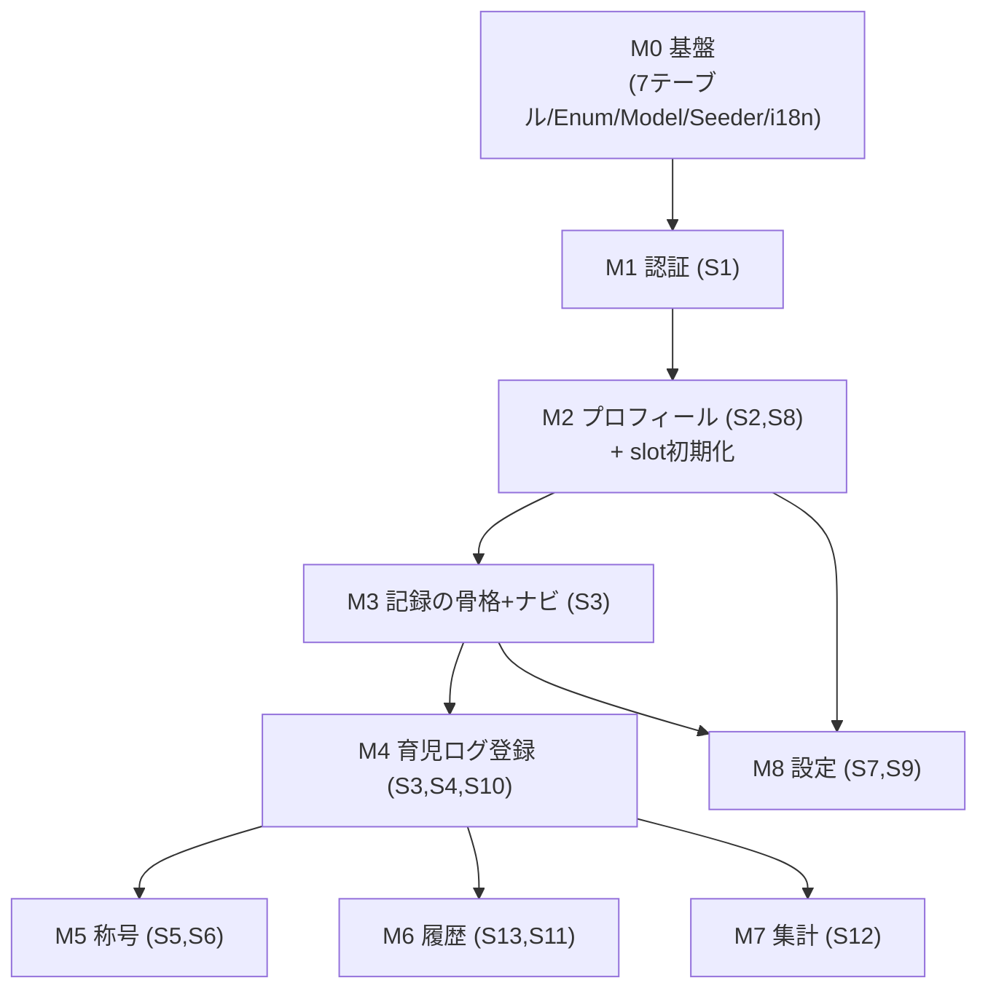

# TotoOps MVP 実装計画（Step 7 タスク分解）

> 本ドキュメントは `summary_v1` の Step 7「MVP から実装を開始する」に向けた**実装順序の設計**です。
> **機能仕様は [features.md](features.md)、画面は [screens.md](screens.md)・[wireframes.md](wireframes.md)、スキーマは [data-model.md](data-model.md)、決定事項は [decisions.md](decisions.md) を正**とします。それらと食い違う場合は各元ドキュメントを優先してください。ここでは「何を・どの順で作るか」だけを扱います。

---

## 1. 分解方針（本ドキュメントの読み方）

- **垂直スライス（縦切り）**：各マイルストーンは「DB → バックエンド → フロント → テスト」まで通しで完結させ、毎回“動いて見せられる”状態でマージする。レイヤーごと（全マイグレーション→全Controller→全Vue）の横切りにはしない。
- **依存順に並べる（番号順 ≠ 依存順）**：features.md の機能一覧・screens.md の S1〜S13 は**トピック順・画面遷移順であって「作れる順」ではない**。ここでは実際の構築依存に従って並べ替える。
- **基盤（M0）を先頭に固定**：features.md・screens.md には現れないが、8テーブル・Enum・Seeder といった土台（[decisions.md](decisions.md) §1.3）が全画面の前提になるため、最初に横切りで一括構築する（テーブル群が FK で相互に絡み分割しづらいため、ここだけは例外的に横切り）。
- **多言語化の規律（全スライス共通）**：M0 で i18n 基盤（軽量版）を敷いた後は、**各スライスで画面の文字列を直書きせず `t('key')` 経由にし、対応するキーを `lang/ja/*` に追加する**（[decisions.md](decisions.md) §1.3）。英訳（`lang/en/*`）は未投入でよく、`fallback_locale = ja` で日本語表示になる（英訳時期は未決 #18）。
- **マスアサインメントの規律（全スライス共通）**：`CareLog`／`Profile`／`UserSlotConfig`／`UserTitle` は `user_id` を fillable に含む（Factory がマスアサインメント経由で生成するため）。Controller から書き込む際は `Model::create($request->validated())` を使わず、必ず `$request->user()->careLogs()->create(...)` のようにリレーション経由で作成し、`user_id` をリクエスト起因の値で埋められないようにする（M2 の `ProfileController`、M4 の `CareLogController`、M5 の `TitleGrantService`、M8 の設定画面で対象）。
- **各スライス共通の Definition of Done（DoD）**：
  - `composer check`（`pint` → `phpstan`(level 8) → `test`）が green
  - Feature テスト中心に happy / failure / edge を網羅（[src/CLAUDE.md](../src/CLAUDE.md) 準拠）
  - 対象画面が実際に遷移・操作できる（該当スライスの範囲で）
  - 画面文字列が `t()` 経由になっており `lang/ja/*` にキーが揃っている
- **作業単位**：1スライス＝1ブランチ／1PR を推奨。`src/` 配下のコーディング作法は [src/CLAUDE.md](../src/CLAUDE.md)（Laravel Boost 生成）に従う。

### 着手前提（環境）

- Docker 起動（`cd docker && docker compose up -d`）、`app` コンテナ内で作業（[dev-commands.md](../dev-commands.md)）
- `.env` に Google OAuth 認証情報（M1 で使用）
- `php artisan migrate:fresh --seed` が通ること

---

## 2. 依存関係グラフ

> M5・M6・M7 は M4 完了後は互いに独立（並行可）。M8 は M2・M3 に依存するが M4 とは独立。

---

## 3. マイルストーン分解表（本体）

### M0 基盤（Foundation）― 横切りで一括構築

- **目的**：全画面の前提になるスキーマ・Enum・Model・Seeder を用意する。
- **依存**：なし
- **対応**：[data-model.md](data-model.md) 全体、[decisions.md](decisions.md) §1.3
- **タスク**：
  - [x] Enum（int backed・`label()` を持つ）：`App\Enums\AgeGroup` / `App\Enums\ChildAgeGroup` / `App\Enums\TitleConditionType`（[data-model.md](data-model.md) ②⑥、[decisions.md](decisions.md) §1.3「コード値とラベルの分離」）
  - [x] マイグレーション（**MVPは7テーブル**。`users`・`care_logs` のみ ULID `CHAR(26)` 主キー、他は連番。[decisions.md](decisions.md) §1.3）：`users` / `profiles` / `care_actions` / `care_logs` / `user_slot_configs` / `titles` / `user_titles`
    - **`users` は既存スキャフォールドの `0001_01_01_000000_create_users_table.php` を直接書き換える（新規マイグレーションで後から ALTER しない）**：`migrate` 実行実績のない greenfield 状態のため、`name`/`email`/`email_verified_at`/`password` カラムと `password_reset_tokens` テーブル定義を削除し、`id` を ULID 化（露出こそしないが将来の API 露出に備えた保険。[decisions.md](decisions.md) §1.3）、`provider`/`provider_id`（`UNIQUE(provider, provider_id)`）を追加。`remember_token` と `sessions` テーブルはそのまま残す（セッション認証で使用。[data-model.md](data-model.md) ①）
    - `care_logs`：`UNIQUE(user_id, care_action_id, occurred_at)`（二重送信防止）、`INDEX(user_id, occurred_at)`、`occurred_at DATETIME`（秒精度）。単独の `INDEX(user_id, care_action_id)` は上記UNIQUEの左端プレフィックスで賄えるため張らない（[data-model.md](data-model.md) ④）
    - `user_slot_configs`：`UNIQUE(user_id, slot_position)`、`UNIQUE(user_id, care_action_id)`
    - `care_actions`：マイグレーション内で `AUTO_INCREMENT` を `CareActionId::CUSTOM_ID_FLOOR`（`1000`）に引き上げ、標準17行用に `1`〜`999` を予約する（[decisions.md](decisions.md) §1.3）
    - FK の `ON DELETE` 方針は data-model.md 各節に従う（`care_action_id`→`care_logs` は CASCADE、`titles`/`user_titles` の `title_id` は RESTRICT 等）
    - **`personal_access_tokens` / Sanctum は作らない（後述「横断事項」の先送り方針）**
  - [x] Model（リレーション・Enum cast。`HasUlids` は `User` と `CareLog` のみ）：`User` / `Profile` / `CareAction` / `CareLog` / `UserSlotConfig` / `Title` / `UserTitle`
  - [x] **`App\Support\CareActionId`（固定ID定数クラス）**：TotoOps標準17行の固定ID（`1`〜`17`）と、カスタム行の採番開始値`CUSTOM_ID_FLOOR = 1000`を名前付き定数（例：`DIAPER_CHANGE`）として定義（[decisions.md](decisions.md) §1.3「ID／主キーの形式」例外規定、[data-model.md](data-model.md) ③）
  - [x] Seeder：`CareActionSeeder`（`user_id IS NULL` の17行。**`CareActionId` 定数で `id`（`1`〜`17`）を明示指定**して作成（保存前に `incrementing = false`）。`sort_order` 1〜17は [features.md](features.md)「育児行動一覧」のカテゴリ順で採番＝`id` の昇順とは一致しない）／`TitleSeeder`（**84行。Count・Streak 両方の `condition_type` を投入し、全17育児行動に銅・銀・金を揃える。対象の育児行動は `CareActionId` 定数で指定し `name` 文字列一致には依存しない。称号名・等級・しきい値は確定済み**。[decisions.md](decisions.md) §1.3・[features.md](features.md)「称号一覧」）
  - [x] Factory（テスト用。各 Model。`CareAction` ファクトリはユーザーカスタム用途のため自動採番のまま＝予約域より上に採番される）
  - [x] `config/totoops.php`：登録時に自動ピン留めする「初期おすすめ8個」を **`CareActionId` 定数の配列**で指定（`name` ではなく固定IDを直接参照。**未決 #11 → 暫定リスト＋TODO**。[decisions.md](decisions.md) §1.3）
  - [x] **i18n 基盤（軽量版・依存追加なし。[decisions.md](decisions.md) §1.3）**：
    - `config/app.php`・`.env.example`：`locale`/`fallback_locale` を `ja`、`faker_locale` を `ja_JP`（現状 `en`）
    - `app/Http/Middleware/SetLocale.php`（cookie→`App::setLocale()`、web ミドルウェアグループに登録。既定 `ja`）
    - `HandleInertiaRequests::share()` に `locale` と現ロケールのメッセージを共有
    - `resources/js/composables/useTrans.ts`（`t(key, replacements?)`。共有 props を参照）
    - `POST /locale`＋`LocaleController@update`（cookie セット＋リダイレクト。ルート名 `locale.update`）
    - `lang/ja/`（`nav.php`・`validation.php` 等の骨組み。各画面のキーは以降のスライスで追加）
- **テスト観点**：`migrate:fresh --seed` 成功、`care_logs` のユニーク制約が効く、Enum cast の往復、`POST /locale` で cookie が変わり `App::getLocale()` が切り替わる。
- **完了条件**：`migrate:fresh --seed` が通る／`composer check` green／ロケール切り替えが効く。
- **ブロッカー**：未決 #11（初期8個）は**暫定値で着手可**、確定後に差し替え。i18n は英訳未投入でも `fallback_locale = ja` で日本語表示になるため着手可（英訳時期は未決 #18）。

---

### M1 認証（S1）

- **目的**：Google SSO でログインし、プロフィール登録状況で遷移分岐する。
- **依存**：M0
- **対応画面/機能**：S1（ログイン画面）／[features.md](features.md)「ユーザー登録・ログイン」／[screens.md](screens.md) ルーティング `login`・`auth.google.*`・`logout`
- **タスク**：
  - [ ] `composer require laravel/socialite`、Google プロバイダ設定（`config/services.php`・`.env`）
  - [ ] ルート：`GET /login`・`GET /auth/google/redirect`・`GET /auth/google/callback`・`POST /logout`
  - [ ] `Auth\AuthenticatedSessionController`（`create` / `destroy`）、`Auth\GoogleSocialiteController`（`redirect` / `callback`）
  - [ ] callback：`provider` + `provider_id` で find/create（`UNIQUE(provider, provider_id)`）。**プロフィール未登録 → `profile.register`（S2）／登録済 → `home`（S3）へリダイレクト**
  - [ ] ミドルウェア：`guest`（S1）・`auth`（以降）
  - [ ] Vue：`Pages/Auth/Login.vue`（Google SSO ボタンのみ。[wireframes.md](wireframes.md) S1）
  - [ ] **`JA|EN` 言語トグル**コンポーネント（M0 の `POST /locale` を叩く。**配置は S1 ログイン画面のみ**。S7 設定画面にも置く＝M8 で対応。全画面ヘッダーには常設しない。[decisions.md](decisions.md) §1.3、[screens.md](screens.md)）
- **テスト観点**：新規ユーザー作成、既存ユーザーの `home` 遷移、未登録ユーザーの `profile.register` 遷移、未認証アクセスの `login` リダイレクト。
- **完了条件**：DoD ＋ ログイン→（登録状況に応じた）遷移が動く。
- **備考**：MVP はセッション認証（[decisions.md](decisions.md) §3.1）。

---

### M2 プロフィール（S2, S8）

- **目的**：初回プロフィール登録と編集。**登録完了時に初期ピン留め8個を作成**する。
- **依存**：M1
- **対応画面/機能**：S2（登録）・S8（編集）／[features.md](features.md)「プロフィール登録」／[screens.md](screens.md) `profile.register`・`profile.store`・`settings.profile.edit`・`settings.profile.update`
- **タスク**：
  - [ ] `ProfileController`（`create` / `store` / `edit` / `update`）、`ProfileRequest`（store・update 共用。`nickname` 必須、`age_group`/`child_age_group` 任意→未選択は `Unanswered` を設定）
  - [ ] `store` 時に `config/totoops.php` の初期8個から `user_slot_configs` に8行を作成（[data-model.md](data-model.md) ⑤、[decisions.md](decisions.md) §1.3）
  - [ ] Policy 不要（ID を URL に含めず常に自分のプロフィールを操作。[screens.md](screens.md) Controller構成の補足）
  - [ ] Vue：`Pages/Profile/Register.vue`（S2）、`Pages/Settings/ProfileEdit.vue`（S8。閲覧も兼ねる）
    - **`child_age_group` のラベルは「いちばん下のお子さんの年齢帯」とし、セレクトの下に「お子さんが複数いる場合は、いちばん下のお子さんを選んでください」という補足文を常時表示する**（多子世帯が迷わないための担保。単一選択で確定済み。[decisions.md](decisions.md) §1.1、[wireframes.md](wireframes.md) S2・S8）。文言は `lang/ja` のキーとして追加する
  - [ ] **`EnsureProfileIsComplete` ミドルウェア**：`$request->user()->profile()->exists()`（`profiles.user_id` の `UNIQUE` インデックスを使った存在確認）が `false` なら `profile.register` へリダイレクト。`auth` 系ルート全体に適用し、`profile.register`・`profile.store`・`logout`・`locale.update` は対象外にする（無限リダイレクト防止）。ログイン直後の callback 分岐（M1）だけでなく、プロフィール未登録のまま `/` 等へ直接アクセスした場合もこのミドルウェアで防ぐ
- **テスト観点**：profile 作成＋slot 8行生成、`nickname` 必須バリデーション、未選択時 `Unanswered`、更新、プロフィール未登録ユーザーが `/` 等へ直接アクセスすると `profile.register` へリダイレクトされる。
- **完了条件**：DoD ＋ 登録後に S3 が「8アイコン表示可能な状態」になる。
- **ブロッカー**：未決 #11（初期8個の中身）。暫定リストで着手可。

---

### M3 記録の骨格＋グローバルナビ（S3, 共通ナビ）

- **目的**：記録画面の器と、4画面（記録/履歴/集計/設定）を行き来する共通ナビを用意する（記録の実配線は M4）。
- **依存**：M2
- **対応画面/機能**：S3（記録画面・表示のみ）・グローバルナビ／[features.md](features.md)「グローバルナビゲーション」／[screens.md](screens.md) `home`
- **タスク**：
  - [ ] `RecordController@index`（`GET /`）：`user_slot_configs` からピン留め済みの8行を `slot_position` 順で取得して渡す
  - [ ] グローバルナビ Layout：モバイル＝下部タブバー／Web＝左サイドバー（記録S3・履歴S13・集計S12・設定S7）。未実装先はプレースホルダ遷移で可（[screens.md](screens.md)「共通UI」）
  - [ ] Vue：`Layouts/AppLayout.vue`（ナビ）、`Pages/Record/Index.vue`（S3。4列×2段の8アイコングリッド＋「その他」ボタン。この時点では表示のみ）
- **テスト観点**：index がピン留め済みの8行を `slot_position` 順で返す、未認証はリダイレクト。
- **完了条件**：DoD ＋ ナビで4画面（プレースホルダ含む）を行き来できる。

---

### M4 育児ログ登録（S3 短タップ, S4, S10）― TotoOps の中核

- **目的**：単一エンドポイントで即時記録・日時指定記録の両方を扱い、二重送信を防ぐ。
- **依存**：M3
- **対応画面/機能**：S3短タップ・S4（その他）・S10（実施日時指定）／[features.md](features.md)「育児ログ登録」「育児行動管理（その他ボタン）」／[screens.md](screens.md) `care-logs.store`・`care-logs.create`・`care-actions.other`
- **タスク**：
  - [ ] `CareLogController`（`create`＝S10 / `store`＝共通登録）、`StoreCareLogRequest`（`care_action_id` 実在＋スコープ、`occurred_at`、`memo` 任意。**`occurred_at <= now() + 5分` の上限バリデーション**を含む。[decisions.md](decisions.md) §1.3）
  - [ ] `CareActionController@other`（`GET /care-actions/other`＝S4）：`user_slot_configs` に無い残りの育児行動を返す（MVP は17個中9個）
  - [ ] `POST /care-logs`：**クライアントが `occurred_at`（秒精度）を必ず送信**。`UNIQUE(user_id, care_action_id, occurred_at)` 衝突は「同じ日時に同じ記録があります」の分かりやすいバリデーションエラー（[decisions.md](decisions.md) §1.3、[data-model.md](data-model.md) ④）
  - [ ] Vue：S3短タップ＝タップ時刻送信＋送信中ボタン disable／長押し→S10。`Pages/CareLogs/Create.vue`（S10・日時指定）、`Pages/CareActions/Other.vue`（S4）
  - [ ] 称号判定はこのスライスでは空配列スタブ（M5 で実装）
- **テスト観点**：1レコード作成、同一 `occurred_at` の二重送信ブロック、「その他」一覧がピン留め8個を除外、S10 分精度の衝突エラー、`occurred_at` 省略時の `now()` フォールバック、`now() + 5分` を超える未来日時が拒否される、`now() + 5分` 以内は許容される。
- **完了条件**：DoD ＋ 短タップ／その他→S10 の両経路で記録できる。

---

### M5 称号（S5, S6）― Count・Streak 両方式

- **目的**：登録の結果として「回数系（Count）」「連続日数系（Streak）」の両方式で称号を同期判定し、獲得モーダル＋X投稿文を出す。
- **依存**：M4
- **対応画面/機能**：S5（称号獲得モーダル）・S6（X投稿文生成モーダル）／[features.md](features.md)「称号判定」「X投稿文生成」／[screens.md](screens.md)（ルートを持たないモーダル）
- **タスク**：
  - [ ] `TitleGrantService`：`titles` を `condition_type` で分岐して判定（[decisions.md](decisions.md) §1.3）。対象範囲はいずれも `titles.care_action_id` で表現（NULL＝全育児行動、値あり＝その育児行動のみ）
    - **Count**：対象範囲の累計記録回数を `COUNT` し `condition_value` と比較
    - **Streak**：対象範囲で `care_logs.occurred_at` の DISTINCT な日付（JST暦日）を新しい順に取得し、**今回保存した育児ログの日付を起点に**連続日数を計算、`condition_value` と比較（専用テーブル・カラムは持たない都度計算）
    - いずれも新規達成のみ `user_titles` を作成（`UNIQUE(user_id, title_id)`）
    - **`achievement_text` をサーバー側で組み立てて返す**：`condition_type`／`care_action_id` の有無（Count育児行動別／Count全体／Streak育児行動別／Streak全体の4パターン）を `lang/ja`（将来 `lang/en`）の `__()` で分岐整形し、現在のロケール（`App::getLocale()`。M0のi18n基盤で既にリクエストごとに設定済み）で完成済みの一文（例：`"累計おむつ交換：100回。"`／`"7日連続育児ログ達成。"`）として返す。X投稿文の言語ごとの文言をVue側と二重管理しない、かつ「サーバー往復なし」の原則も壊さない（このデータは既存の`POST /care-logs`レスポンスに乗るだけで追加リクエストは発生しない）
  - [ ] `CareLogController@store` から同期呼び出し、Inertia レスポンスに獲得称号（`name`・`achievement_text`）を含める
  - [ ] Vue：`components/TitleUnlockedModal.vue`（S5）、`components/XShareModal.vue`（S6・**固定レイアウト部分（絵文字・称号名・ハッシュタグ）のみクライアント側で組み立て**、`achievement_text` はサーバーから受け取った値をそのまま埋め込む＋コピー＋Xを開くリンク。サーバー往復なし）
  - [ ] `user_titles` は永久保持（`care_logs` 編集・削除で再判定・取り消しをしない。Streak も同様。[decisions.md](decisions.md) §1.3）
- **テスト観点**：Count・Streak それぞれでしきい値到達時に付与、二重付与なし、レスポンスに獲得称号（`name`・`achievement_text`）が含まれる、4パターンそれぞれで `achievement_text` の文面が正しい、既取得は再付与しない、Streak は記録が1日途切れると連続日数がリセットされる、バックデート入力（S10）でも起点日から正しく連続日数を数える。
- **完了条件**：DoD ＋ 記録→称号獲得（Count・Streak 双方）→X投稿文コピーの流れが動く。
- **ブロッカー**：なし（称号名・等級・しきい値は確定済み。[decisions.md](decisions.md) §1.3「称号名・等級・しきい値の確定内容」）。

---

### M6 履歴（S13, S11）

- **目的**：記録をタイムラインで振り返り、実施日時変更・削除を行う。
- **依存**：M4
- **対応画面/機能**：S13（記録履歴）・S11（ログ編集）／[features.md](features.md)「記録履歴（タイムライン）」／[screens.md](screens.md) `history.index`・`care-logs.edit`・`care-logs.update`・`care-logs.destroy`
- **タスク**：
  - [ ] `HistoryController@index`（`GET /history`）：日付ごとにグループ化・新しい順
  - [ ] `CareLogController`（`edit` / `update` / `destroy`）、`UpdateCareLogRequest`（**`occurred_at` のみ許可**。育児行動の変更は不可＝削除→再作成。**`occurred_at <= now() + 5分` の上限バリデーションは `StoreCareLogRequest` と共通**。[decisions.md](decisions.md) §1.3）
  - [ ] `CareLogPolicy`（`update` / `delete`＝所有者チェック。`{care_log}` が URL に ID 付きで現れる唯一のリソースのため Policy 必須。[screens.md](screens.md) 補足）
  - [ ] Vue：`Pages/History/Index.vue`（S13・各行「・・・」→S11。**`care_logs` が0件の場合は空状態を表示**：「まだ記録がありません」＋S3へのリンクボタン。[wireframes.md](wireframes.md) S13空状態）、`Pages/CareLogs/Edit.vue`（S11・日時変更／削除のみ）
- **テスト観点**：他人の記録を Policy で弾く、`occurred_at` のみ更新、削除、更新先が既存行と衝突→バリデーションエラー、未来日時（`now() + 5分` 超）への変更が拒否される、記録0件時に空状態が表示される。
- **完了条件**：DoD ＋ 履歴から日時変更・削除ができる。

---

### M7 集計（S12）

- **目的**：日/週/月/全期間の集計と、全期間タブでの累計実績を表示する。
- **依存**：M4
- **対応画面/機能**：S12（期間別集計）／[features.md](features.md)「ダッシュボード集計」／[screens.md](screens.md) `stats.index`
- **タスク**：
  - [ ] `StatsController@index`（`GET /stats`）：日/週/月/全期間の集計（Query Scope）＋育児行動ごとの件数内訳。全期間タブ＝累計実績（累計おむつ交換数 等）。自分の `care_logs` を直接集計（Phase 2 の集約テーブルは使わない。[decisions.md](decisions.md) §1.3）
  - [ ] Vue：`Pages/Stats/Index.vue`（S12・日/週/月/全期間タブ＋グラフ＋内訳テーブル。**対象期間の記録が0件の場合は空状態を表示**：「まだ記録がありません」＋S3へのリンクボタン。[wireframes.md](wireframes.md) S12空状態）
  - [ ] Phase 2 導線（称号図鑑・全体傾向）は本スライスでは**器のみ or 省略**（[screens.md](screens.md) S12 備考、[decisions.md](decisions.md) §1.3）
- **テスト観点**：各期間の集計値の正しさ、育児行動別の内訳、対象期間の記録が0件のときに空状態が表示される（グラフ・内訳の代わりに）。
- **完了条件**：DoD ＋ 4タブの集計が表示される。

---

### M8 設定（S7, S9）

- **目的**：設定ハブと、常時8アイコンのピン留め入れ替え。ログアウト導線。
- **依存**：M2, M3
- **対応画面/機能**：S7（設定ハブ）・S9（ピン留め設定）／[features.md](features.md)「設定画面（ハブ）」「育児行動管理（常時8アイコン）」／[screens.md](screens.md) `settings.index`・`settings.slots.edit`・`settings.slots.update`
- **タスク**：
  - [ ] `SettingsController@index`（`GET /settings`＝S7ハブ。プロフィール編集・ピン留め設定・ログアウトへの入口。全体集計導線は置かない＝[decisions.md](decisions.md) §1.3）
  - [ ] `SlotConfigController`（`edit`＝S9 / `update`）、`UpdateSlotConfigRequest`（8個・重複不可・許可された育児行動のみ・`slot_position` 1〜8。Policy 不要＝自分にスコープ）。**`update` は delete-insert 方式**：バリデーション通過後、対象ユーザーの既存8行を全削除→新しい8行を挿入を1トランザクションで実行する（1行ずつUPDATEすると入れ替え途中で`UNIQUE(user_id, care_action_id)`に触れうるため。[decisions.md](decisions.md) §1.3）
  - [ ] Vue：`Pages/Settings/Index.vue`（S7）、`Pages/Settings/Slots.vue`（S9）
  - [ ] **S7 に `JA|EN` 言語切り替え項目**（M0 の `POST /locale` を叩く。S1 と並ぶ言語切り替えの2箇所目。[decisions.md](decisions.md) §1.3）
  - [ ] カスタム育児行動管理（S14）・卒業・広告は Phase 2+ の“器”として導線プレースホルダのみ（[screens.md](screens.md) S7・S14）
- **テスト観点**：ピン留め入れ替え（delete-insert）で一意制約違反にならない、育児行動の重複拒否、許可外の育児行動の拒否、ログアウト、言語切り替えで cookie が変わる。
- **完了条件**：DoD ＋ ピン留めを変更すると S3 の8アイコンに反映される。

---

## 4. 横断事項

### ブロッカー（未決事項）と着手可否

| 未決 # | 内容 | 影響スライス | 対応 |
| --- | --- | --- | --- |
| #11 | 共通のおすすめ初期8個 | M0（config）・M2（slot生成） | 暫定リストで着手可。確定後に `config/totoops.php` を差し替え |
| #4 | 称号のしきい値 | M0（TitleSeeder）・M5（判定） | 暫定値で着手可。構造は確定、数値のみ後決め |
| #15 | トークン有効期限 | （MVP対象外） | Prunable/API 段階で扱う。MVP に影響なし |
| #5,#8,#12,#13,#14,#16 | 集計匿名化・PWA・卒業・通知・公開サイト | Phase 2+ | MVP 範囲外 |

### 認証方式の整理／Sanctum 先送り

- Inertia 同一ドメイン構成の Web ログインは **Socialite ＋ セッション認証**で完結する。MVP では `personal_access_tokens`（Sanctum のトークン認証テーブル）を**作らない・使わない**。
- トークン認証が要るのは将来の API / NativePHP クライアントを持つ段階から（[decisions.md](decisions.md) §3.1）。後付けはマイグレーション1本で済み、「後付けが高コストな基盤（主キー形式・ログ/マスタ分離・冪等性）」には該当しないため、YAGNI で先送りが妥当。
- **要確認（ユーザー判断事項）**：[data-model.md](data-model.md) は `personal_access_tokens`（⑧）を「MVP 8テーブル」の1つとして ✅確定 扱いにしている。本計画では MVP を**7テーブル**とするため、data-model.md 側に「⑧は API 段階で追加」の注記を足すか、8テーブル表記のままにするかは**未確定**として残す（勝手に一本化しない）。

### 学習要素の対応（参考）

各スライスの Laravel / Vue 学習要素は [features.md](features.md) 機能一覧表の該当行を参照（Queue/Supervisor は MVP では登場せず、Phase 3 の通知・Prunable/Scheduler で扱う。[decisions.md](decisions.md) §3.2）。

---

## 5. 参照

- 機能仕様：[features.md](features.md)
- 画面・ルーティング・Controller：[screens.md](screens.md) ／ 画面詳細：[wireframes.md](wireframes.md)
- スキーマ：[data-model.md](data-model.md)
- 決定事項・未決事項・設計原則：[decisions.md](decisions.md)
- コンセプト（線引き）：[concept.md](concept.md) ／ 個人情報方針：[privacy.md](privacy.md)
- 開発コマンド：[dev-commands.md](../dev-commands.md) ／ Laravel 作法：[src/CLAUDE.md](../src/CLAUDE.md)
