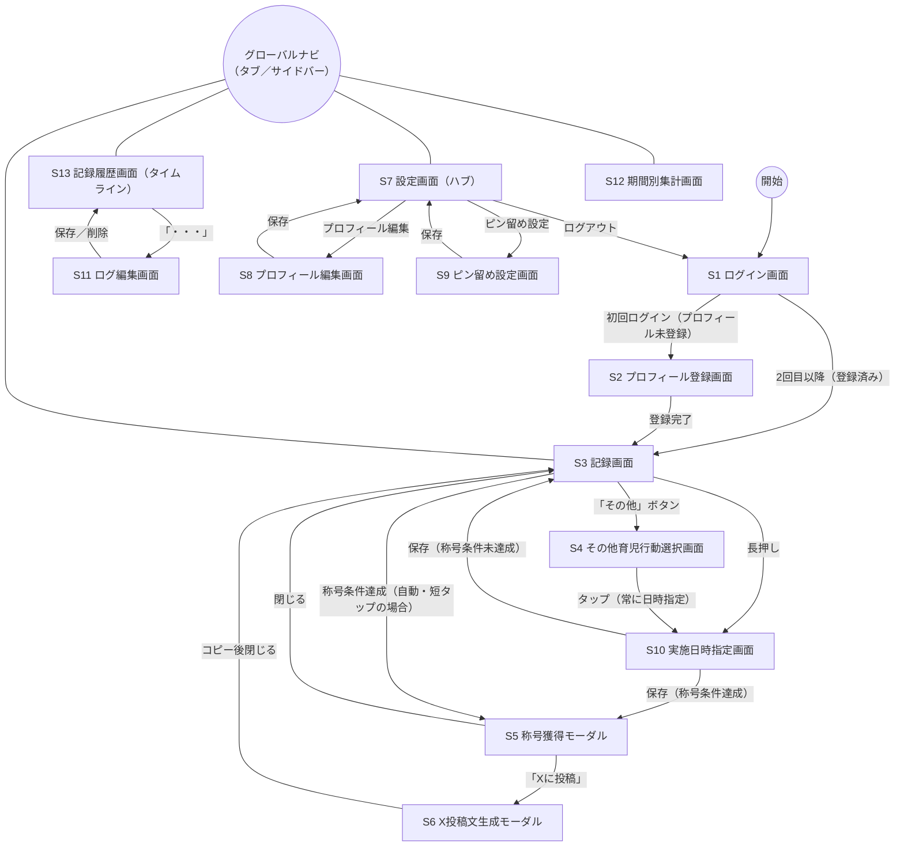

# TotoOps MVP 画面設計（Step 3）

> 本ドキュメントは Laravel 実装前の **MVP 画面一覧・ルーティング・Controller構成** の設計です。
> [features.md](features.md) のMVP機能一覧・[data-model.md](data-model.md) の8テーブルをもとに、実際の画面単位に落とし込みます。

## 進め方

1. 画面一覧・画面遷移図（俯瞰）
2. ルーティング一覧
3. Controller構成 ← 今ここ

> 各画面のコントロール配置（ボタン・入力欄・タブなど）の詳細は [wireframes.md](wireframes.md) を参照。

---

## 画面一覧

| # | 画面名 | 概要 | 対応するMVP機能（[features.md](features.md)） |
|---|---|---|---|
| S1 | ログイン画面 | Google SSOボタンのみ | ユーザー登録・ログイン |
| S2 | プロフィール登録画面 | 初回ログイン時のみ。ニックネーム（必須）・年代／子どもの年齢帯（ともに任意） | プロフィール登録 |
| S3 | 記録画面 | ヘッダー（ユーザーアイコン※Google SSOから取得・DBには保存しない。設定へはグローバルナビから遷移）＋常時8アイコン（**短タップ＝即記録**／**長押し＝S10で日時指定**）＋「その他」ボタン（→S4） | 育児行動管理／育児ログ登録 |
| S4 | 「その他」育児行動選択画面 | ピン留めされていない残りの候補一覧。項目をタップすると**常にS10（実施日時指定画面）を経由**する（瞬間記録は行わない。低頻度・後追い記録が多いため） | 育児行動管理（その他ボタン） |
| S5 | 称号獲得モーダル | 称号獲得時に記録画面（S3）上にオーバーレイ表示 | 称号獲得 |
| S6 | X投稿文生成モーダル | 称号獲得モーダルから遷移。生成文のコピー・Xを開くリンク | X投稿文生成・コピー |
| S7 | 設定画面（ハブ） | プロフィール編集・ピン留め設定・ログアウトへの入口（Phase 2以降のカスタム育児行動管理・卒業・広告への導線は器として用意。カスタム育児行動管理の画面設計自体は済み。→S14。全体集計への導線はS12側に置くため、ここには含めない） | 設定画面（ハブ） |
| S8 | プロフィール編集画面 | 設定画面から遷移。現在のニックネーム・年代・子どもの年齢帯を表示し、その場で変更できる（閲覧専用画面は別途用意しない） | 設定画面（ハブ） |
| S9 | ピン留め設定画面 | 常時8個の入れ替え（⑤`user_slot_configs`を編集） | 育児行動管理（常時8アイコン） |
| S10 | 実施日時指定画面 | S3の8アイコンを長押し、またはS4の項目をタップした際に遷移する。`occurred_at`を指定して育児ログを記録する | 育児ログ登録 |
| S11 | ログ編集画面 | S13（記録履歴画面）の各行の「・・・」から遷移する。**「実施日時の変更」または「削除」のみ**可能（育児行動の変更は不可。育児行動を変えたい場合は削除→S3/S4から再記録） | 育児ログ登録 |
| S12 | 期間別集計画面 | 日/週/月/**全期間**タブ＋グラフ＋育児行動ごとの件数内訳（全期間タブでは自分の累計実績を確認できる）。（全期間タブに称号一覧（図鑑）画面・全体タスク傾向（みんなの傾向）画面への導線を追加予定。Phase 2） | ダッシュボード集計 |
| S13 | 記録履歴画面（タイムライン） | 日付ごとにグループ化したログ一覧（新しい順）。各行「・・・」→S11 | 記録履歴（タイムライン） |

Phase 2以降の「全体タスク傾向」「卒業＆エンドロール」「称号一覧（図鑑）画面」等の画面はこの一覧には含めていません（MVP対象外）。

---

## 共通UI：グローバルナビゲーション

S3・S12・S13・S7の4画面は、常時表示のナビゲーションから互いに行き来する。それ以外の画面（S4・S10・S11・S2・S8・S9）やモーダル（S5・S6）には表示しない。

- **モバイル（優先）**：画面下部のタブバー。項目は「記録（S3）」「履歴（S13）」「集計（S12）」「設定（S7）」の4つ。
- **Web（PC）**：画面左のサイドバー。同じ4項目を縦に並べる。

### 言語切り替え（`JA|EN`）

言語切り替えは **S1（ログイン画面）と S7（設定画面）の2箇所のみ**に置く（全画面ヘッダーには常設しない）。タップで `POST /locale`（`locale.update`）を叩き、cookie にロケールを保存して直前の画面へリダイレクトする。用途は「父親は日本人だが、外国人の妻に英語で見せたい時に切り替える」こと（[decisions.md](decisions.md) §1.3）。ログイン前後に S1 で選び、ログイン後は S7 から変更する。既定は `ja`、英語未翻訳のキーは日本語にフォールバックする。ロケールは cookie 保持で DB には保存しない。

---

## 画面遷移図（全体俯瞰）

補足：

- S4・S10・S11は入力・編集を伴うため独立したページ（URLを持つ画面）とする。S5・S6は表示のみのためモーダル（S3上のUI状態）のまま、専用ルートは持たない。詳細は次の「ルーティング一覧」を参照。
- 称号獲得は、育児ログ登録の結果として**自動的に**発生する遷移であり、ユーザー操作による遷移ではない。S3の短タップは直接S5に、長押し・S4経由はS10の保存後にS5に、それぞれ分岐する。
- S4はもはや単独で育児ログを記録しない（必ずS10を経由する）。
- S12・S13はS3から分離した独立画面であり、グローバルナビゲーション（タブバー／サイドバー）経由でS3・S7と相互に行き来する。

---

## ルーティング一覧

ページ系（GET、Inertiaでレンダリングする画面）と、データ変更のみを行うアクション系（POST/PATCH/DELETE、ページを返さない）に分けて整理する。Controllerのクラス・メソッド構成は次の「Controller構成」で検討する。

### ページ（GET）

| Method | URI | ルート名 | 対応画面 | 備考 |
|---|---|---|---|---|
| GET | `/login` | `login` | S1 ログイン画面 | Google SSOボタンのみ |
| GET | `/auth/google/redirect` | `auth.google.redirect` | (S1の遷移先) | Google認証開始（Socialite） |
| GET | `/auth/google/callback` | `auth.google.callback` | (S1の遷移先) | 認証コールバック。プロフィール未登録ならS2へ、登録済みならS3へリダイレクト |
| GET | `/profile/register` | `profile.register` | S2 プロフィール登録画面 | 初回ログイン時のみ |
| GET | `/` | `home` | S3 記録画面 | 認証済みユーザーのトップ。未認証は`/login`へリダイレクト |
| GET | `/care-actions/other` | `care-actions.other` | S4 「その他」育児行動選択画面 | ピン留めされていない候補一覧 |
| GET | `/care-logs/create` | `care-logs.create` | S10 実施日時指定画面 | クエリで対象育児行動を受け取る（例：`?care_action_id=`） |
| GET | `/care-logs/{care_log}/edit` | `care-logs.edit` | S11 ログ編集画面 | S13の各行から遷移 |
| GET | `/settings` | `settings.index` | S7 設定画面（ハブ） | |
| GET | `/settings/profile` | `settings.profile.edit` | S8 プロフィール編集画面 | 閲覧も兼ねる |
| GET | `/settings/slots` | `settings.slots.edit` | S9 ピン留め設定画面 | |
| GET | `/stats` | `stats.index` | S12 期間別集計画面 | |
| GET | `/history` | `history.index` | S13 記録履歴画面（タイムライン） | |

### アクション（POST/PATCH/DELETE、ページを返さない）

| Method | URI | ルート名 | 用途 | 備考 |
|---|---|---|---|---|
| POST | `/profile` | `profile.store` | S2の登録処理 | 完了後`/`（S3）へリダイレクト |
| POST | `/care-logs` | `care-logs.store` | 育児ログ記録 | S3短タップ／S10保存の共通エンドポイント。クライアントは短タップ時もタップ時刻（ミリ秒精度）を`occurred_at`として送信する（省略時の`now()`は二重送信防止が効かないフォールバック。[decisions.md](decisions.md) §1.3） |
| PATCH | `/care-logs/{care_log}` | `care-logs.update` | S11保存 | `occurred_at`のみ変更可 |
| DELETE | `/care-logs/{care_log}` | `care-logs.destroy` | S11削除 | |
| PATCH | `/settings/profile` | `settings.profile.update` | S8保存 | |
| PUT | `/settings/slots` | `settings.slots.update` | S9保存 | ピン留め8個の入れ替え |
| POST | `/logout` | `logout` | S7のログアウト | |
| POST | `/locale` | `locale.update` | 言語切り替え（`JA\|EN` トグル） | cookieにロケール保存後、直前の画面へリダイレクト。全画面ヘッダー共通（[decisions.md](decisions.md) §1.3） |

**ルートを持たない画面**：S5（称号獲得モーダル）・S6（X投稿文生成モーダル）。S5は`POST /care-logs`のレスポンス（称号獲得情報を含む）を受けてVue側で自動表示する。S6はそのレスポンスに含まれる`achievement_text`（達成内容を表す一文。サーバー側で組み立て済み。[decisions.md](decisions.md) §1.3）を、絵文字・称号名・ハッシュタグ等の固定レイアウトにクライアント側で埋め込むのみで、いずれも追加のサーバー往復は不要。

---

## Controller構成

同一リソースを扱う画面はControllerを統合する（Laravelのリソースコントローラ規約に沿う）。`profiles`はS2・S8をまとめて`ProfileController`、`care_logs`はS10・S11・保存/削除をまとめて`CareLogController`が担当する。

| 画面/用途 | ルート | Controller | メソッド | FormRequest | Policy |
|---|---|---|---|---|---|
| S1 ログイン画面 | GET `/login` | `Auth\AuthenticatedSessionController` | `create()` | — | — |
| (S1の遷移先) | GET `/auth/google/redirect` | `Auth\GoogleSocialiteController` | `redirect()` | — | — |
| (S1の遷移先) | GET `/auth/google/callback` | `Auth\GoogleSocialiteController` | `callback()` | — | — |
| S7のログアウト | POST `/logout` | `Auth\AuthenticatedSessionController` | `destroy()` | — | — |
| S2 プロフィール登録画面 | GET `/profile/register` | `ProfileController` | `create()` | — | — |
| (S2の送信) | POST `/profile` | `ProfileController` | `store()` | `ProfileRequest` | 不要（IDをURLに含めず常に自分のプロフィールのみ操作） |
| S8 プロフィール編集画面 | GET `/settings/profile` | `ProfileController` | `edit()` | — | 同上 |
| (S8の保存) | PATCH `/settings/profile` | `ProfileController` | `update()` | `ProfileRequest`（storeと共用） | 同上 |
| S3 記録画面 | GET `/` | `RecordController` | `index()` | — | — |
| S4 「その他」育児行動選択画面 | GET `/care-actions/other` | `CareActionController` | `other()` | — | — |
| S10 実施日時指定画面 | GET `/care-logs/create` | `CareLogController` | `create()` | — | — |
| (S3短タップ／S10保存) | POST `/care-logs` | `CareLogController` | `store()` | `StoreCareLogRequest` | — |
| S11 ログ編集画面 | GET `/care-logs/{care_log}/edit` | `CareLogController` | `edit()` | — | `CareLogPolicy@update`（他人の記録IDを弾く） |
| (S11保存) | PATCH `/care-logs/{care_log}` | `CareLogController` | `update()` | `UpdateCareLogRequest`（`occurred_at`のみ許可） | `CareLogPolicy@update` |
| (S11削除) | DELETE `/care-logs/{care_log}` | `CareLogController` | `destroy()` | — | `CareLogPolicy@delete` |
| S7 設定画面（ハブ） | GET `/settings` | `SettingsController` | `index()` | — | — |
| S9 ピン留め設定画面 | GET `/settings/slots` | `SlotConfigController` | `edit()` | — | — |
| (S9保存) | PUT `/settings/slots` | `SlotConfigController` | `update()` | `UpdateSlotConfigRequest`（重複不可・許可された育児行動のみ） | 不要（同上の理由） |
| S12 期間別集計画面 | GET `/stats` | `StatsController` | `index()` | — | — |
| S13 記録履歴画面 | GET `/history` | `HistoryController` | `index()` | — | — |

補足：

- Policyが必要なのは`care_logs`のみ。`{care_log}`がURLにID付きで現れるため、他人のレコードを弾くための`CareLogPolicy`が必要になる。他のリソース（プロフィール・スロット設定）はIDをURLに含めず常に「自分自身」に暗黙スコープするため、Policyは不要と判断した。
- `ProfileRequest`はstore/updateで同一ルール（`nickname`必須、`age_group`/`child_age_group`任意）のため1クラスを共用する。

---

## Phase 2以降の画面（仕様検討中）

MVPの画面一覧（S1〜S13）には含めないが、実装より前に仕様を検討しているPhase 2以降の画面。

### 称号一覧（図鑑）画面

- **概要**：獲得済みの称号を主役として一覧表示し、あわせて**「次に獲得できる称号」だけ**を進捗％付きで見せる（[features.md](features.md)「称号一覧（図鑑）画面」）
- **到達点**：S12（期間別集計画面）の`全期間`タブから遷移。累計実績と同じ「自分の積み上げの振り返り」という文脈でまとめる。グローバルナビには追加しない
- **表示仕様**：画面は2セクション構成にする。
  - **「獲得した称号」セクション**：`user_titles`に行がある称号のみを表示。称号名・`grade`（銅／銀／金）のバッジ・獲得日（`unlocked_at`）を出す。並び順は`titles.sort_order`昇順（[data-model.md](data-model.md) ⑥「`sort_order`の位置づけ」）
  - **「次の称号」セクション**：**各系統につき1件だけ**、進捗％（現在値／`condition_value`）付きで表示する。ここでいう系統とは `(care_action_id, condition_type)` の組で、その系統の未獲得称号のうち`condition_value`が最小のものが「次の1件」にあたる。並び順は同じく`titles.sort_order`昇順
- **未獲得称号を全件は出さない理由**：未達リストが常時見える状態は「あと◯回足りない」というノルマ感を生み、「叱責ではなく振り返り」というコンセプト（[concept.md](concept.md)）と相性が悪い。一方で獲得済みのみだと登録直後は空画面になり、次の目標も見えないため、その折衷として「次の1件」だけを見せる（[decisions.md](decisions.md) §1.3「称号の提示順・等級・一覧表示」）
- **データ取得**：`titles`を主テーブルにした`user_titles`への`LEFT JOIN`（`unlocked_at IS NULL`＝未獲得）で両セクションを1クエリから組み立てられる。**未獲得称号を表示するために`user_titles`の行をあらかじめ作る必要はない**（[data-model.md](data-model.md) ⑦）
- **進捗％の算出**：`Count`は対象範囲の`care_logs`件数／`condition_value`、`Streak`は現在の連続日数／`condition_value`。いずれも既存の称号判定ロジックと同じ計算式を使う（[decisions.md](decisions.md) §1.3「称号判定」）

### カスタム育児行動管理画面（S14）

- **概要**：ユーザーが自分専用の育児行動（`care_actions.user_id`が自分のIDの行）を作成・削除する画面。生存数は合計8個まで。9個目を作成する際は既存8個から1つを選んで**物理削除**し、紐づく`care_logs`も`ON DELETE CASCADE`で道連れに削除する（削除前に警告表示・同意必須。[decisions.md](decisions.md) §1.3、[data-model.md](data-model.md) ③）
- **到達点**：S7（設定画面ハブ）から遷移。グローバルナビには追加しない
- **ルーティング**：

| Method | URI | ルート名 | 備考 |
|---|---|---|---|
| GET | `/settings/custom-care-actions` | `settings.custom-care-actions.index` | 一覧＋追加フォーム（上限到達時は追加フォームを非表示／非活性） |
| POST | `/settings/custom-care-actions` | `settings.custom-care-actions.store` | 追加。8個上限を超える場合はバリデーションエラー |
| DELETE | `/settings/custom-care-actions/{care_action}` | `settings.custom-care-actions.destroy` | 物理削除。確認モーダルで警告表示後に実行 |

- **Controller**：`CustomCareActionController`（`index`/`store`/`destroy`）。`store`は`StoreCustomCareActionRequest`（上限8個・自分の`user_id`スコープ内での名前重複チェック）。TotoOps標準17行との採番の衝突は`care_actions`のAUTO_INCREMENT予約域（`1`〜`999`）でDB側が保証するため、アプリ層のガードは持たない（[decisions.md](decisions.md) §1.3、[data-model.md](data-model.md) ③）。`destroy`は`CustomCareActionPolicy@delete`（他人のカスタム育児行動IDを弾く）
- 画面詳細（コントロール配置）は[wireframes.md](wireframes.md) S14を参照
