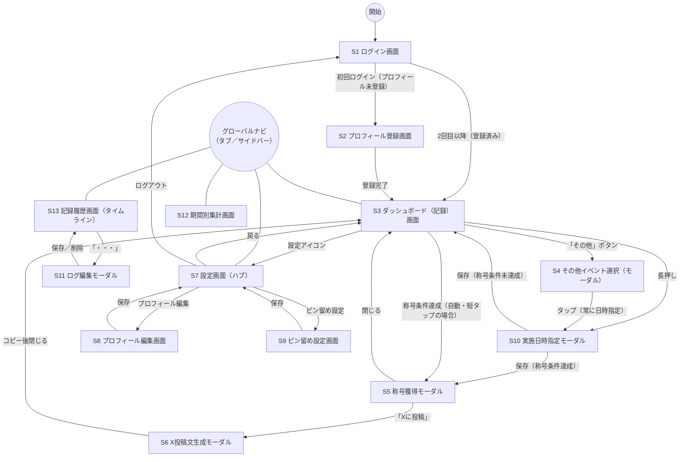

# TotoOps MVP 画面設計（Step 3）

> 本ドキュメントは Laravel 実装前の **MVP 画面一覧・ルーティング・Controller構成** の設計です。
> [features.md](features.md) のMVP機能一覧・[data-model.md](data-model.md) の8テーブルをもとに、実際の画面単位に落とし込みます。

## 進め方

1. 画面一覧・画面遷移図（俯瞰） ← 今ここ
2. ルーティング一覧
3. Controller構成

---

## 画面一覧

| # | 画面名 | 概要 | 対応するMVP機能（[features.md](features.md)） |
|---|---|---|---|
| S1 | ログイン画面 | Google SSOボタンのみ | ユーザー登録・ログイン |
| S2 | プロフィール登録画面 | 初回ログイン時のみ。ニックネーム（必須）・年代／子どもの年齢帯（ともに任意） | プロフィール登録 |
| S3 | ダッシュボード（記録）画面 | ヘッダー（左：ユーザーアイコン※Google SSOから取得・DBには保存しない／右：設定⚙→S7）＋常時8アイコン（**短タップ＝即記録**／**長押し＝S10で日時指定**）＋「その他」ボタンのみのシンプルな記録画面。集計・累計実績・記録履歴はS12・S13に分離した | 育児イベント種別管理／育児イベント登録 |
| S4 | 「その他」イベント選択（モーダル） | ピン留めされていない残りの候補一覧。項目をタップすると**常にS10（日時指定モーダル）を経由**する（瞬間記録は行わない。低頻度・後追い記録が多いため） | 育児イベント種別管理（その他ボタン） |
| S5 | 称号獲得モーダル | 称号獲得時にダッシュボード上にオーバーレイ表示 | 称号獲得 |
| S6 | X投稿文生成モーダル | 称号獲得モーダルから遷移。生成文のコピー・Xを開くリンク | X投稿文生成・コピー |
| S7 | 設定画面（ハブ） | プロフィール編集・ピン留め設定・ログアウトへの入口（Phase 2以降の卒業・全体集計・広告への導線は器として用意） | 設定画面（ハブ） |
| S8 | プロフィール編集画面 | 設定画面から遷移。ニックネーム・年代・子どもの年齢帯の変更 | 設定画面（ハブ） |
| S9 | ピン留め設定画面 | 常時8個の入れ替え（⑤`user_slot_configs`を編集） | 育児イベント種別管理（常時8アイコン） |
| S10 | 実施日時指定モーダル | S3の8アイコンを長押し、またはS4の項目をタップした際に開く。`occurred_at`を指定して育児イベントを記録する | 育児イベント登録 |
| S11 | ログ編集モーダル | S13（記録履歴画面）の各行の「・・・」から開く。**「実施日時の変更」または「削除」のみ**可能（イベント種別の変更は不可。種別を変えたい場合は削除→S3/S4から再記録） | 育児イベント登録 |
| S12 | 期間別集計画面 | 日/週/月/**全期間**タブ＋グラフ＋イベント種別ごとの件数内訳（全期間タブでは自分の累計実績を確認できる） | ダッシュボード集計 |
| S13 | 記録履歴画面（タイムライン） | 日付ごとにグループ化したログ一覧（新しい順）。各行「・・・」→S11 | 記録履歴（タイムライン） |

Phase 2以降の「全体タスク傾向」「卒業＆エンドロール」「称号一覧（図鑑）画面」等の画面はこの一覧には含めていません（MVP対象外）。

---

## 共通UI：グローバルナビゲーション

S3・S12・S13・S7の4画面は、常時表示のナビゲーションから互いに行き来する。モーダル系画面（S4〜S6、S10、S11）には表示しない。

- **モバイル（優先）**：画面下部のタブバー。項目は「記録（S3）」「履歴（S13）」「集計（S12）」「設定（S7）」の4つ。
- **Web（PC）**：画面左のサイドバー。同じ4項目を縦に並べる。

---

## 画面遷移図（全体俯瞰）

補足：

- S4・S5・S6・S10・S11はモーダル想定のため、実際のルーティング（URLを持つページか、S3上のUI状態か）は次の「ルーティング一覧」で検討する。
- 称号獲得は、育児イベント登録の結果として**自動的に**発生する遷移であり、ユーザー操作による遷移ではない。S3の短タップは直接S5に、長押し・S4経由はS10の保存後にS5に、それぞれ分岐する。
- S4はもはや単独でイベントを記録しない（必ずS10を経由する）。
- S12・S13はS3から分離した独立画面であり、グローバルナビゲーション（タブバー／サイドバー）経由でS3・S7と相互に行き来する。
